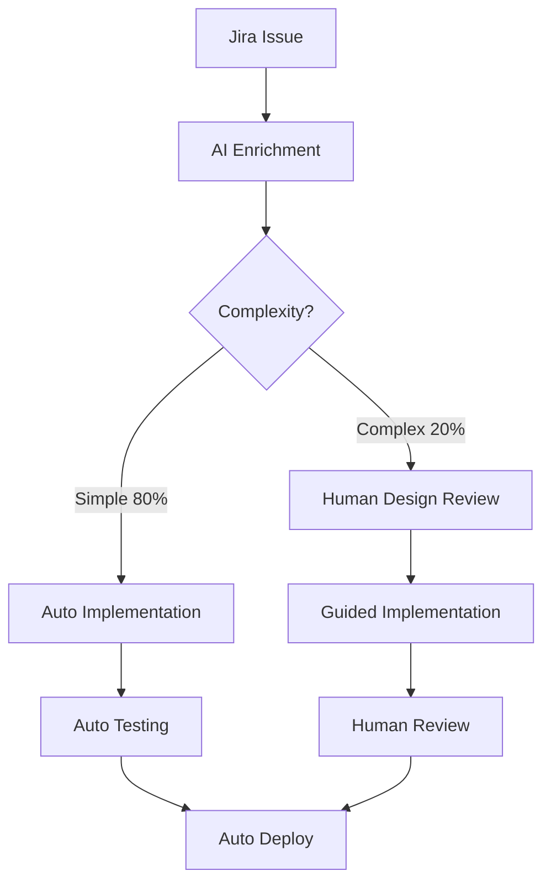

# Harmonoid: AI Orchestration Platform

## Overview
Harmonoid is OmniGaze's comprehensive AI orchestration platform that serves as the central command center for managing AI CLIs (Claude Code, Google Gemini) and specialized AI agents. Built as a Blazor Server application, it provides real-time control, human intervention management, and team-based AI collaboration for all development and business operations.

## Vision
Create a unified AI orchestration layer that transforms OmniGaze into a fully AI-augmented organization, where intelligent agents collaborate with humans to achieve 10x productivity gains across all business functions.

## Core Architecture

### System Overview
```
Harmonoid (Blazor UI) - Port 5150
    ├── CLI Process Management
    │   ├── Claude Code CLI
    │   ├── Google Gemini CLI
    │   └── Future: Additional AI CLIs
    ├── AI Partners Orchestration
    │   ├── Code Partner (Development)
    │   ├── Data Partner (Analytics)
    │   ├── Security Partner (Auditing)
    │   └── Jira PM Partner (Project Management)
    ├── MCP Manager (Model Context Protocol)
    │   ├── Atlassian MCP (Jira/Confluence)
    │   ├── Dinero MCP (Finance)
    │   ├── GitHub MCP (Source Control)
    │   └── OmniGaze MCP (Platform)
    └── Data Layer (Protocol Buffers)
        ├── Teams Configuration
        ├── Agent Profiles
        ├── Activity Logs
        └── Token Usage Metrics
```

## Key Features

### 1. AI CLI Management
**Purpose**: Centralized control of AI command-line interfaces

**Capabilities**:
- **Process Management**: Start, stop, restart AI CLIs with proper cleanup
- **Real-time Streaming**: SignalR-based output streaming with ANSI color support
- **Human Intervention**: Automatic detection of Y/N prompts and permission requests
- **Notification System**: Browser tab alerts when human input needed
- **Terminal Emulation**: Full terminal-style UI with color-coded output
- **Working Directory**: Standardized on `F:\RootContext` for consistency

**Technical Details**:
- Built with .NET 8.0 and Blazor Server
- SignalR hubs for WebSocket communication
- AnsiToHtmlConverter for terminal output
- Process management with proper Windows cleanup

### 2. AI Partners System
**Purpose**: Specialized AI agents for different business domains

**Partner Types**:
1. **Code Partner**
   - Code analysis and review
   - Bug detection and fixes
   - Refactoring suggestions
   - Security vulnerability identification
   - MCP Tools: file operations, code analysis

2. **Data Partner**
   - Data analysis and insights
   - SQL query generation
   - ETL transformations
   - Statistical analysis
   - MCP Tools: data operations, schema analysis

3. **Security Partner**
   - Security auditing
   - Vulnerability detection
   - Compliance checking
   - Dependency scanning
   - MCP Tools: security scanners, compliance validators

4. **Jira Project Manager Partner**
   - Issue creation and updates
   - Sprint planning and tracking
   - Epic and story management
   - Team velocity analysis
   - MCP Tools: Full Atlassian MCP suite

**Model Support**:
- OpenAI (GPT-4, GPT-3.5)
- Ollama (Local models)
- LM Studio (Local fine-tuned models)
- Future: Claude, Gemini, custom models

### 3. Teams Management UI
**Purpose**: Configure and manage AI agent teams

**Features**:
- **Team Creation**: Build specialized teams for different projects
- **Agent Configuration**: 
  - Model selection (provider, parameters)
  - Role assignment (PM, Developer, QA, Security)
  - Schedule management (work hours, availability)
  - Jira board access control
- **Permission Management**:
  - Granular MCP tool permissions
  - Risk assessment indicators
  - Permission templates (PM, Dev, QA, Read-only)
- **Activity Monitoring**:
  - Real-time status updates
  - Task execution history
  - Token usage tracking
  - Cost estimation

**UI Components**:
- Team cards with status indicators
- Agent configuration dialogs
- Permission matrix visualization
- Activity feed with filtering
- Token usage dashboard

### 4. MCP Integration
**Purpose**: Unified interface for external tool access

**Integrated MCP Servers**:
1. **Atlassian MCP**
   - OAuth authentication
   - Jira operations (issues, sprints, epics)
   - Confluence operations (pages, spaces)
   - Respects existing permissions

2. **Dinero MCP** (Custom built)
   - Financial operations
   - Invoice management
   - Customer billing
   - Financial reporting

3. **GitHub MCP** (Planned)
   - Repository operations
   - PR management
   - CI/CD triggers
   - Code review automation

4. **OmniGaze MCP** (Live)
   - Platform operations
   - Discovery engine control
   - Asset management
   - Customer workspace management

**MCP Features**:
- **Function Calling**: Native LLM function calling support
- **Permission System**: Partner-specific tool access
- **Audit Trail**: Complete operation logging
- **Error Handling**: Graceful degradation and retry logic
- **Schema Generation**: Automatic tool schema for LLMs

### 5. Data Persistence Layer
**Purpose**: Efficient storage using OmniGaze DAL paradigm

**Implementation**:
- Protocol Buffer serialization
- Compressed binary storage
- Atomic save operations
- Automatic log pruning
- Session-based metrics

**Data Models**:
```csharp
Team
  ├── Id, Name, Description
  ├── Agents[]
  │   ├── Role, PartnerType
  │   ├── Configuration
  │   └── Permissions
  ├── Configuration
  │   ├── JiraProject
  │   ├── IntegrationTokens
  │   └── Workflow
  └── Metrics
      ├── TokenUsage
      ├── TasksCompleted
      └── CostEstimate
```

## Use Cases

### Development Automation (80/20 Rule)

#### Automated Issue Resolution Pipeline
**Target**: 80% of bugs and small features handled automatically



**Implementation Details**:
- **Issue Enrichment**: AI adds logs, context, validation criteria
- **Complexity Analysis**: Automatic categorization based on scope
- **Auto Implementation**: AI generates fix following patterns
- **Validation**: Automated testing with mock environments
- **Human Touch**: Only for design decisions and architecture

#### Core Automation Features
- **Automated Code Reviews**: AI partners review PRs for best practices
- **Bug Fixing**: 80% automatic resolution with test generation
- **Feature Implementation**: AI pair programming for new features
- **Security Auditing**: Continuous vulnerability scanning
- **Documentation**: Automatic code documentation generation

### Project Management
- **Sprint Planning**: AI-assisted story estimation and planning
- **Issue Management**: Automatic issue creation from various sources
- **Status Updates**: Daily standup report generation
- **Resource Allocation**: Team capacity optimization
- **Risk Management**: Early warning for project delays

### Business Operations
- **Customer Onboarding**: Automated setup workflows
- **Financial Reporting**: Monthly reports via Dinero integration
- **Meeting Intelligence**: Transcript processing and action extraction
- **Email Processing**: Automatic classification and response
- **Knowledge Management**: Customer intelligence aggregation

### Communication Intelligence
- **Email Scanning**: All team inbox monitoring
- **Meeting Transcription**: Teams meeting processing
- **Task Extraction**: Automatic task creation from communications
- **Sentiment Analysis**: Customer satisfaction tracking
- **Follow-up Management**: Ensuring nothing falls through cracks

## Integration Architecture

### MCP Server Strategy
**Purpose**: Secure data access with local processing and cloud orchestration

#### Hybrid Architecture
```yaml
Cloud Layer (Claude Opus):
  Purpose: Orchestration and intelligence
  Functions:
    - Task planning
    - Decision making
    - Result validation
  Format: XML prompting (25% performance improvement)

Local Layer (Ollama/Local LLM):
  Purpose: Data processing and security
  Functions:
    - Customer data processing
    - Sensitive operations
    - Mock data generation
  Location: On-premises or laptop

MCP Bridge:
  Purpose: Secure interface
  Functions:
    - Data anonymization
    - Schema extraction
    - Result aggregation
```

#### XML Prompting Benefits
```xml
<!-- Native format for Claude - 25% better performance -->
<task>
  <context>Customer environment details</context>
  <objective>Specific goal to achieve</objective>
  <constraints>Security and compliance rules</constraints>
  <validation>Success criteria</validation>
</task>
```

### Claude Code Integration
```yaml
Harmonoid → Claude Code CLI
  ├── Process spawn with --dangerously-skip-permissions
  ├── Working directory: F:\RootContext
  ├── Real-time output capture
  ├── Intervention detection
  ├── MCP server connectivity
  └── XML prompt optimization
```

### GitHub CI/CD Integration
```yaml
Harmonoid → GitHub Actions
  ├── Trigger workflows via AI agents
  ├── Monitor build status
  ├── Automated PR creation
  ├── Deployment orchestration
  └── Rollback management
```

### Atlassian Integration
```yaml
Harmonoid → Atlassian MCP → Jira/Confluence
  ├── OAuth authentication flow
  ├── Issue CRUD operations
  ├── Sprint management
  ├── Documentation updates
  └── Permission enforcement
```

## Security & Compliance

### Security Features
- **OAuth Authentication**: Secure external service access
- **Role-Based Access**: Granular permission management
- **Token Encryption**: Secure credential storage
- **Audit Logging**: Complete operation history
- **Defensive Security**: Enforced security-only practices

### Compliance
- **GDPR**: Data handling compliance
- **SOC 2**: Security controls
- **Audit Trail**: Full traceability
- **Data Retention**: Configurable policies
- **Access Control**: Multi-level permissions

## Development & Deployment

### Development Environment
- **Platform**: Windows (primary), cross-platform capable
- **Framework**: .NET 8.0, Blazor Server
- **Port**: 5150 (development)
- **Working Directory**: F:\RootContext

### Quick Start Commands
```powershell
# Fast rebuild (~5 seconds)
cd F:\RootContext\Harmonoid\Harmonoid
dotnet build --configuration Release --no-restore
dotnet run --configuration Release --no-build --urls "http://localhost:5150"

# Full rebuild (when packages change)
.\start-harmonoid.bat

# Stop application
Stop-Process -Id (Get-NetTCPConnection -LocalPort 5150).OwningProcess -Force
```

### Deployment
- **Production**: Windows Server or Azure App Service
- **Scaling**: Horizontal scaling with SignalR backplane
- **Monitoring**: Application Insights integration
- **Updates**: Blue-green deployment strategy

## Performance Metrics

### System Metrics
- **Startup Time**: <5 seconds (optimized build)
- **Response Time**: <100ms for UI operations
- **Concurrent Users**: 50+ supported
- **Task Processing**: 100+ tasks/minute
- **Memory Usage**: <500MB typical

### Business Impact
- **Development Velocity**: 10x improvement target
- **Bug Resolution**: 50% faster
- **Project Delivery**: 30% time reduction
- **Documentation**: 100% automated
- **Meeting Efficiency**: 40% time saved

## Roadmap

### Phase 1: Foundation (Completed)
- ✅ CLI process management
- ✅ Real-time output streaming
- ✅ Human intervention detection
- ✅ Basic UI implementation

### Phase 2: AI Partners (Completed)
- ✅ Partner framework implementation
- ✅ MCP integration
- ✅ Task queue system
- ✅ Permission management

### Phase 3: Teams Management (In Progress)
- ✅ Teams UI implementation
- ✅ Agent configuration
- ✅ Token usage tracking
- 🔄 Advanced analytics

### Phase 4: Advanced Features (Q1 2026)
- PTY support for full terminal emulation
- Multi-CLI session tabs
- Agent learning and optimization
- Cross-partner collaboration
- Advanced caching system

### Phase 5: Enterprise Features (Q2 2026)
- Multi-tenant support
- Enterprise SSO integration
- Advanced compliance reporting
- Custom partner development SDK
- Marketplace for partner templates

## Best Practices

### Agent Configuration
1. Start with minimal permissions
2. Use role-based templates
3. Monitor token usage closely
4. Implement gradual permission expansion
5. Regular security audits

### Task Management
1. Use appropriate priority levels
2. Batch related tasks
3. Implement retry logic
4. Monitor queue depth
5. Regular performance reviews

### MCP Tool Usage
1. Validate permissions before execution
2. Log all operations
3. Implement timeout handling
4. Use caching where appropriate
5. Regular tool inventory review

## Training & Documentation

### User Training
- Harmonoid UI overview
- Agent configuration guide
- Permission management
- Task creation and monitoring
- Troubleshooting guide

### Developer Documentation
- Partner development guide
- MCP tool integration
- Custom provider implementation
- API reference
- Code examples

## Success Metrics

### Technical KPIs
- System uptime: >99.9%
- Task success rate: >95%
- Average response time: <100ms
- Concurrent operations: 100+
- Error rate: <1%

### Business KPIs
- Development velocity increase: 10x
- Bug resolution time: -50%
- Documentation coverage: 100%
- Project delivery speed: +30%
- Team satisfaction: >90%

## Support & Maintenance

### Monitoring
- Real-time dashboard
- Alert configuration
- Performance metrics
- Usage analytics
- Cost tracking

### Maintenance
- Weekly updates
- Security patches
- Performance optimization
- Feature additions
- Bug fixes

---

*Last Updated: August 20, 2025*
*Platform Owner: John Fabienke (CTO)*
*Repository: F:\RootContext\Harmonoid*
*Documentation: Continuously updated with platform evolution*