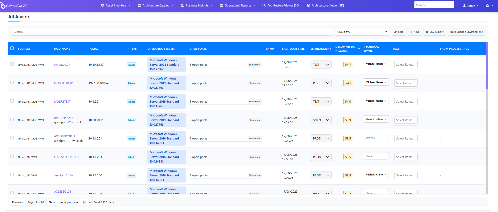
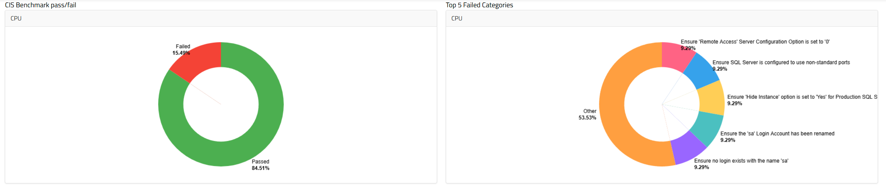

# Why OmniGaze - From a CISO Perspective

## A Simple Truth About Modern Security

Every CISO faces the same challenge: proving resilience, not just buying tools. Boards and regulators don't want to hear about your security stack anymore. They want one answer: "Are we secure?"

The honest answer for most organizations? "We think so, but we can't be sure."

Not because security teams aren't talented or tools aren't sophisticated. But because you can't secure what you can't see. And in today's hybrid, multi-cloud, shadow IT world, most organizations can't see 30-40% of their infrastructure.

## The Reality We All Face

**The Numbers Don't Lie:**
- 60%+ of breaches exploit legacy vulnerabilities that should have been patched
- Average enterprise has 30% shadow IT they don't know exists
- Compliance audits take weeks because data is scattered across dozens of tools
- Millions spent on security tools that don't talk to each other

**The Regulatory Pressure:**
- DORA demands operational resilience you can prove
- NIS2 requires comprehensive risk management
- GDPR violations average €20M in fines
- Board liability is now personal under new regulations

You need continuous assurance, not quarterly reviews. You need demonstrable control, not best efforts.

## OmniGaze: Your Real-Time Security Blueprint

OmniGaze is the fastest, cheapest, and most complete way to reduce security and compliance risk by giving you a real-time digital blueprint where every dependency is mapped, every risk is visible, and nothing is left to chance.

### What We Do Differently

**1. Continuous Discovery - Not Periodic Scans**

*Complete visibility across Windows, Linux, cloud, and shadow IT*

- Automatically discovers ALL assets - on-premises, cloud, shadow IT
- Identifies vulnerabilities and misconfigurations as they appear
- Maps every dependency so you understand blast radius instantly
- Updates in real-time, not quarterly

**2. Automated Compliance - Not Manual Reports**

*Automated CIS benchmark compliance checking across all SQL servers*

- Asset inventory for ISO27001, NIS2, GDPR, CIS18, DORA reporting at the click of a button
- Continuous compliance monitoring, not point-in-time snapshots
- Evidence collection automated, not screenshot marathons
- Audit-ready posture maintained daily, not scrambled quarterly
- Windows event logs aggregated and analyzed automatically
- much more

**3. Risk Intelligence - Not Just Alerts**

*Comprehensive risk dashboard showing vulnerabilities, compliance gaps, and security posture*

- AI-driven anomaly detection catches threats before they escalate
- Risk scoring based on YOUR environment, not generic ratings
- Prioritization that matters - focus on the 3% that could hurt you
- Predictive analysis to prevent tomorrow's incidents
- more

&nbsp;

**4. Geographic Visibility - Know Where Your Risk Lives**

*See where unknown assets are hiding across your global infrastructure*

### Integration That Amplifies Your Existing Investment

We don't ask you to replace anything. OmniGaze's open API architecture integrates with:
- **Microsoft Defender & Intune** - Enrich with infrastructure context
- **ServiceNow** - Keep your CMDB accurate automatically
- **Your SIEM** - Add asset intelligence to every alert
- **Existing tools** - Make them better with complete visibility
- **Many more** 

**Result:** Higher ROI from tools you've already bought.

&nbsp;

## The Practical Benefits

### Immediate Wins (Month 1)
- Discover 20-30% unknown assets
- Identify critical vulnerabilities on forgotten systems
- Generate first report
- Reduce false positives by 70%

### Quick Value (Months 2-3)
- 85% reduction in risk exposure
- Automated evidence for upcoming audit
- Integrated security operations
- Demonstrable improvement in security posture

### Sustained Excellence (Months 4+)
- Continuous compliance maintained
- Predictive risk management
- Proactive threat prevention
- Board-ready dashboards always current

## The Risk of Doing Nothing

Every day without complete visibility is a gamble:
- **Regulatory fines**  
- **Breach costs**  
- **Tool waste** - Millions spent on disconnected tools with 30% utilization
- **Board liability** - Personal responsibility for security failures

&nbsp;

## Why CISOs Choose OmniGaze

### It's Simple
- Deploy in hours, not months
- No agents on most systems
- Works with what you have

### It's Complete
- Every asset discovered
- Every vulnerability tracked
- Every asset inventory compliance requirement mapped
- Every dependency understood

### It's Proven
- 85% risk reduction on average
- Compliance achieved 3x faster
- Audit costs reduced by 75%
- ROI within first quarter

## A Practical Conversation

**Board Member:** "How do we know we're secure?"

**You (without OmniGaze):** "We have strong controls and follow best practices based on our last assessment..."

**You (with OmniGaze):** "Here's our real-time security posture. We can see 100% of our infrastructure, we're tracking 47 critical vulnerabilities with remediation in progress, we're 94% compliant with all frameworks, and our risk score has improved 85% in six months. Let me show you the dashboard."

Which conversation would you rather have?

&nbsp;

## Your Next Step

We're not asking you to transform overnight or replace your security stack. We're offering you something simpler: complete visibility and demonstrable control.

Start with a proof of concept:
1. Deploy OmniGaze in your environment (takes minutes)
2. See what you've been missing (usually 20-30% of infrastructure)
3. Generate your first automated compliance report
4. Calculate the ROI from just the discovered waste

---

*"OmniGaze gave us what we needed most: the ability to tell our board with confidence that we are in control - at all times. It's not about having more tools; it's about having complete visibility."*

&nbsp;

### Key Capabilities at a Glance

| What You Get | How It Helps | Business Impact |
|--------------|--------------|-----------------|
| Continuous Discovery | Find ALL assets, vulnerabilities, shadow IT | 85% risk reduction |
| Automated Compliance | Asset inventory ISO27001, NIS2, GDPR, CIS18, DORA reporting | 75% less audit cost |
| Dependency Mapping | Understand blast radius instantly | 70% faster incident response |
| Open API Integration | Works with Defender, ServiceNow, SIEMs | Higher ROI from existing tools |

**Bottom Line:** OmniGaze is the fastest, cheapest, and most complete way to cut risk, prove compliance, and demonstrate control.