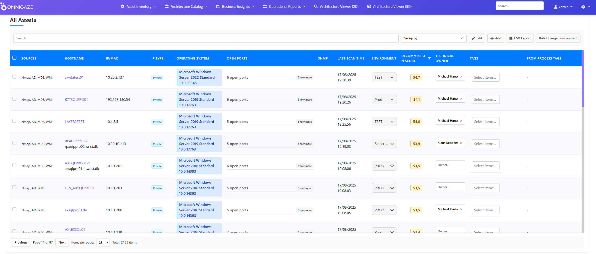
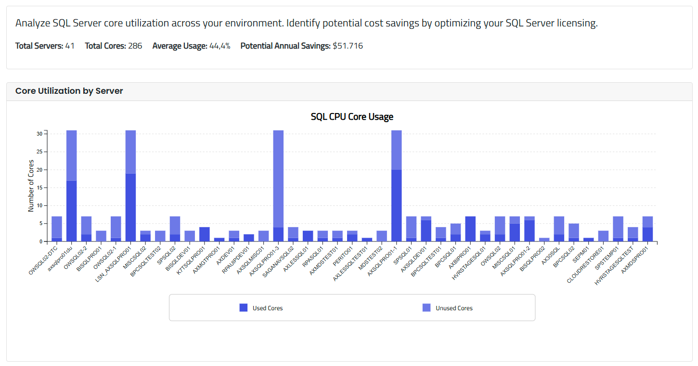
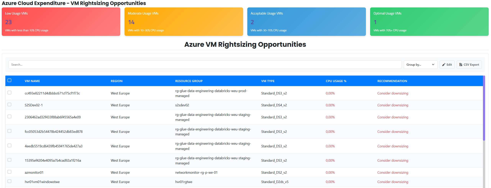
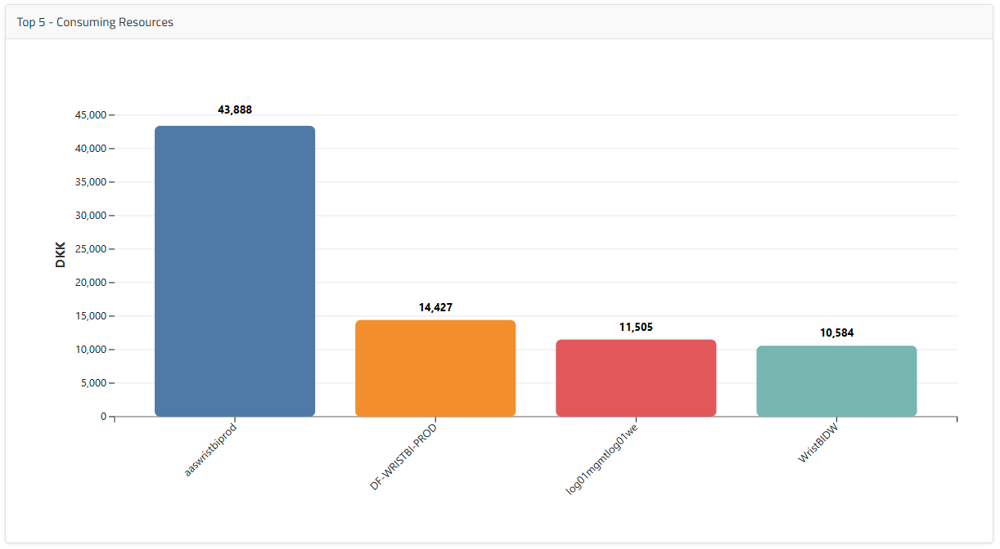
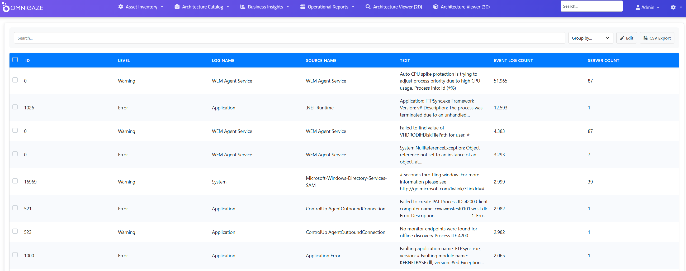
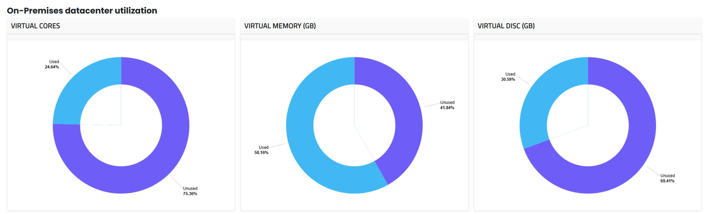
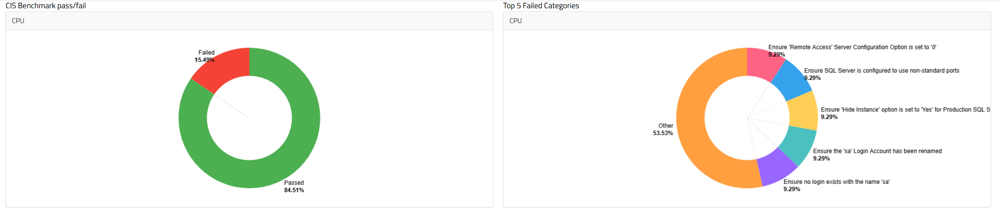
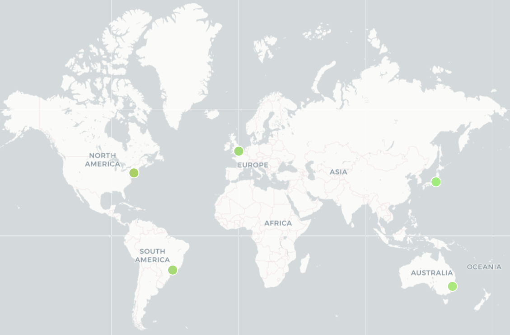
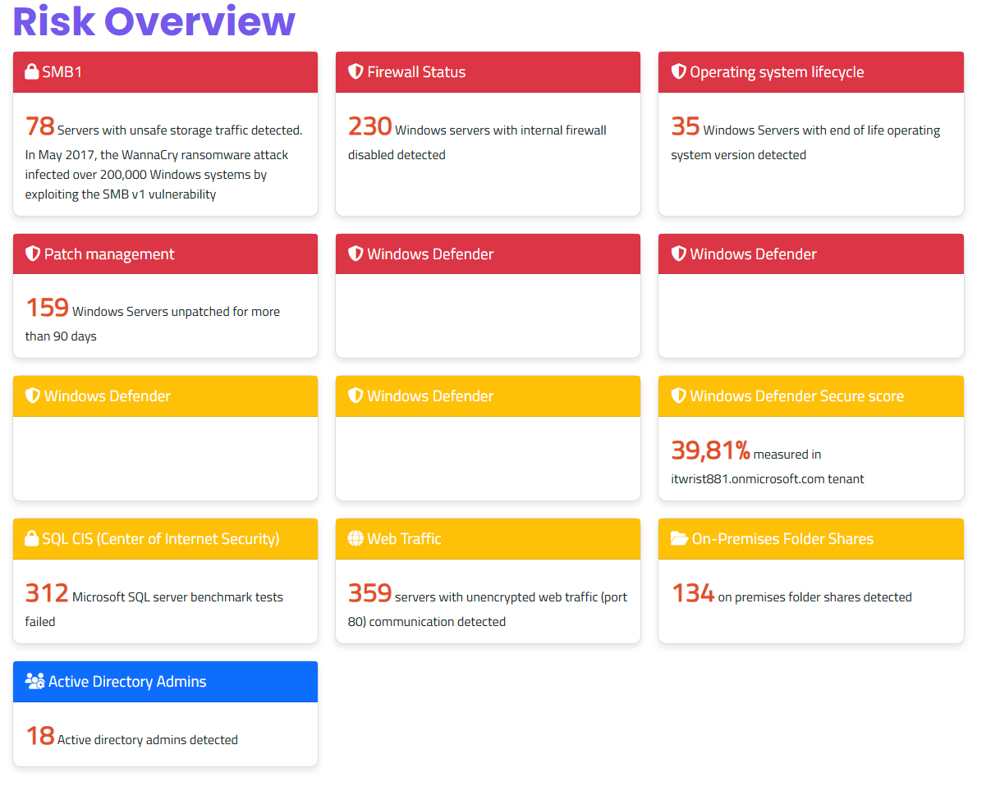

# Why OmniGaze - From a Head of IT Perspective

## The Daily IT Challenge

As IT leaders, we face increasing complexity. Multiple cloud providers, hybrid infrastructure, legacy systems, and shadow IT create blind spots that make effective management challenging. Most organizations struggle with:

- **Limited visibility** - Only seeing 60-70% of actual infrastructure
- **Tool sprawl** - 5-10 monitoring tools that don't integrate
- **Manual processes** - Weeks spent on audits and compliance reports  
- **Resource waste** - 30-40% of IT budget spent on underutilized resources
- **Reactive operations** - Fighting fires instead of preventing them

OmniGaze helps address these challenges through automated discovery and intelligent analysis.

## What OmniGaze Actually Does

### 1. Complete Infrastructure Discovery

*Automated discovery across Windows, Linux, cloud, and virtualized environments*

OmniGaze automatically discovers and maps your entire IT infrastructure:
- Windows and Linux servers (physical and virtual)
- Cloud resources (Azure)
- SQL Server instances and databases
- Active Directory users and groups
- Network connections and dependencies
- Running applications and services

**Typical discovery results:**
- 20-30% unknown assets identified
- Complete hardware and software inventory
- Real-time status of all systems
- Automatic CMDB population

### 2. SQL Server Optimization

*Identify consolidation opportunities across your SQL Server estate*

Our SQL analysis capabilities help reduce licensing costs:
- Discover all SQL instances (including forgotten ones)
- Identify underutilized servers for consolidation
- CIS benchmark compliance checking
- Performance bottleneck analysis
- License optimization recommendations

**Typical savings:** 30-40% reduction in SQL licensing costs through consolidation

### 3. Cloud Cost Management

*Identify oversized cloud resources and optimization opportunities*

Comprehensive cloud cost analysis:
- Rightsizing recommendations based on actual usage
- Idle resource identification
- Reserved instance optimization
- Cross-subscription cost visibility
- Department and project cost allocation

*Track cloud spending across resources, subscriptions, and regions*

&nbsp;

### 4. Operational Intelligence

*Aggregated Windows event log analysis for proactive issue detection*

Transform reactive IT operations:
- Aggregated event log analysis across all servers
- Predictive failure detection
- Automated root cause analysis
- Change tracking and impact assessment
- Performance anomaly detection

### 5. Resource Utilization Analysis

*Identify over-provisioned on-premises resources*

Optimize your on-premises infrastructure:
- CPU and memory utilization tracking
- Identify zombie servers (powered on, unused)
- Capacity planning based on trends
- Hardware refresh planning
- Workload migration candidates

### 6. Security and Compliance

*Automated compliance checking against industry standards*

Maintain security posture and compliance:
- CIS benchmark assessments
- Vulnerability tracking
- Account usage monitoring
- Geographic asset distribution
- Automated compliance reporting

*Understand where unknown assets are located globally*

&nbsp;

## Integration Capabilities

OmniGaze integrates with your existing tools through:

- **ServiceNow** - Automatic CMDB updates and enrichment
- **Microsoft Defender** - Enhanced threat context
- **Azure APIs** - Cloud resource synchronization
- **Active Directory** - User and group management
- **OData API** - Standards-based data access for any system
- **PowerBI** - Custom dashboards and reporting

## Practical Implementation

### Week 1: Discovery
- Deploy OmniGaze (óne lightweight installation. No agents on all assets)
- Discover all infrastructure assets
- Identify quick wins (zombie servers, unused licenses)
- Generate first visibility report

### Week 2-4: Analysis
- Analyze resource utilization patterns
- Identify consolidation opportunities
- Map application dependencies
- Calculate potential savings

### Month 2-3: Optimization
- Implement consolidation recommendations
- Rightsize cloud resources
- Decommission unused assets
- Automate compliance reporting

### Ongoing: Continuous Improvement
- Monitor for drift and changes
- Predictive capacity planning
- Proactive issue prevention
- Regular optimization reviews

## Measurable Benefits

Based on typical deployments:

| Area | Typical Improvement | Timeline |
|------|-------------------|----------|
| Unknown assets discovered | 20-30% | Week 1 |
| SQL license reduction | 30-40% | Month 2 |
| Cloud cost optimization | 25-35% | Month 1 |
| Incident reduction | 30-60% | Month 3 |
| Audit preparation time | 75% less | Immediate |
| False positive alerts | 80% reduction | Month 1 |

## The IT Team Perspective

OmniGaze helps your team work more effectively:

- **Less firefighting** - Predictive analytics prevent issues
- **Automated documentation** - Always current infrastructure maps
- **Faster troubleshooting** - Complete dependency visibility
- **Strategic focus** - Time freed up for innovation projects
- **Skill development** - Work on transformation, not maintenance

## Cost Justification

### Direct Savings
- **License optimization**: Identify unused software licenses
- **Hardware consolidation**: Reduce server footprint by 15-30%
- **Cloud optimization**: Right-size resources, eliminate waste
- **Power and cooling**: Fewer servers to maintain

### Indirect Benefits
- **Reduced downtime**: Predictive maintenance prevents outages
- **Faster resolution**: Complete visibility speeds troubleshooting
- **Audit efficiency**: Automated asset inventory compliance reporting
- **Staff productivity**: Less time on manual tasks

### Typical ROI
- Implementation cost recovered in 2-3 months
- 3-5x ROI in first year
- Ongoing savings through continuous optimization

## Risk Mitigation

*Comprehensive risk dashboard showing vulnerabilities and compliance gaps*

OmniGaze helps reduce IT risks:
- **Shadow IT discovery** - Find unauthorized systems
- **Vulnerability management** - Track and prioritize patches
- **Asset inventory Compliance assurance** - Continuous monitoring
- **Change control** - Understand impact before changes
- **Disaster recovery** - Complete asset inventory for planning

## Why IT Departments Choose OmniGaze

### Simple to Deploy
- Agentless discovery for most systems
- Lightweight agents where needed
- No infrastructure changes required
- Works alongside existing tools

### Comprehensive Coverage
- Windows, Linux, cloud, virtualized environments
- Applications, databases, middleware
- Network dependencies and connections
- User accounts and permissions

### Actionable Intelligence
- Specific recommendations, not just data
- Prioritized actions based on impact
- Clear ROI calculations
- Step-by-step remediation guidance

### Proven Results
- Used by large enterprises across Europe
- Consistent savings across industries
- Rapid time to value
- High user satisfaction scores

&nbsp;

## Getting Started

We recommend starting with a proof of concept:

1. **Scope Definition** (1 day)
   - Select representative environment
   - Define success criteria
   - Identify key stakeholders

2. **Deployment** (2-3 days)
   - Install discovery components
   - Configure integrations
   - Initial discovery run

3. **Analysis** (1 week)
   - Review discovered assets
   - Identify optimization opportunities
   - Calculate potential savings

4. **Presentation** (1 day)
   - Share findings with stakeholders
   - Demonstrate quick wins
   - Plan full deployment

## Summary

OmniGaze provides IT departments with the visibility and intelligence needed to:
- **See everything** - Complete infrastructure discovery
- **Optimize resources** - Reduce waste and redundancy
- **Prevent problems** - Predictive analytics and monitoring
- **Prove value** - Clear metrics and cost savings
- **Enable innovation** - Free up time for strategic initiatives

We understand the challenges IT departments face. OmniGaze is designed to make your infrastructure visible, manageable, and optimized - helping you deliver better service while reducing costs.

---

*Ready to see what OmniGaze can discover in your environment?*  
*Let's start with a no-obligation proof of concept.*