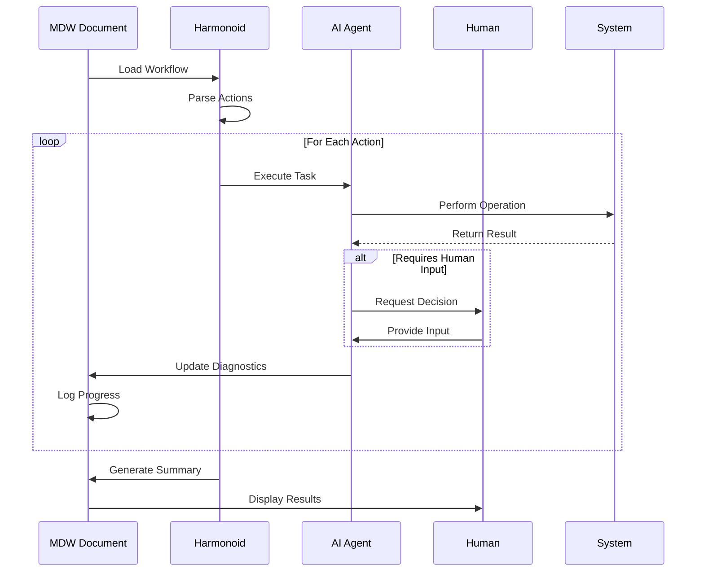
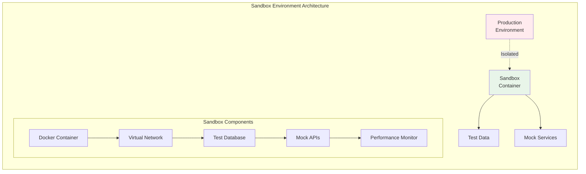
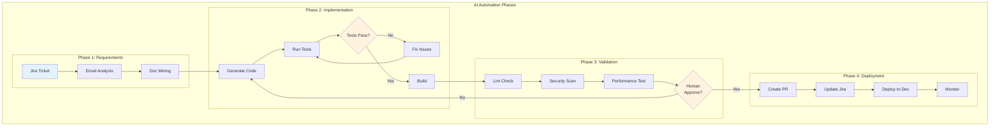
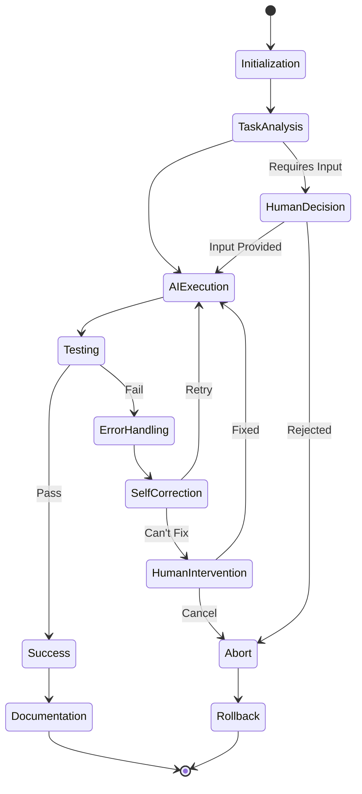
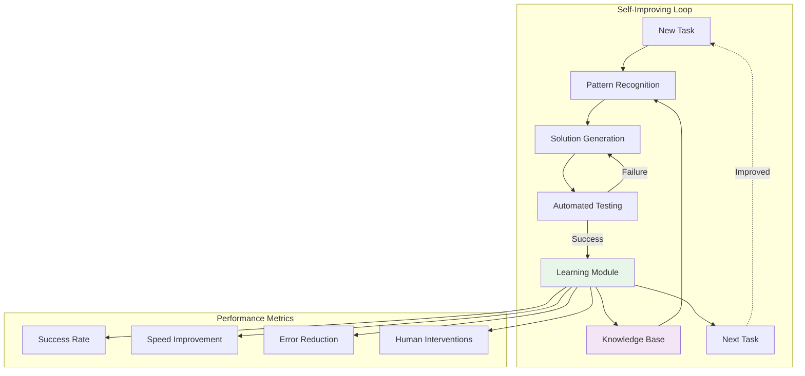
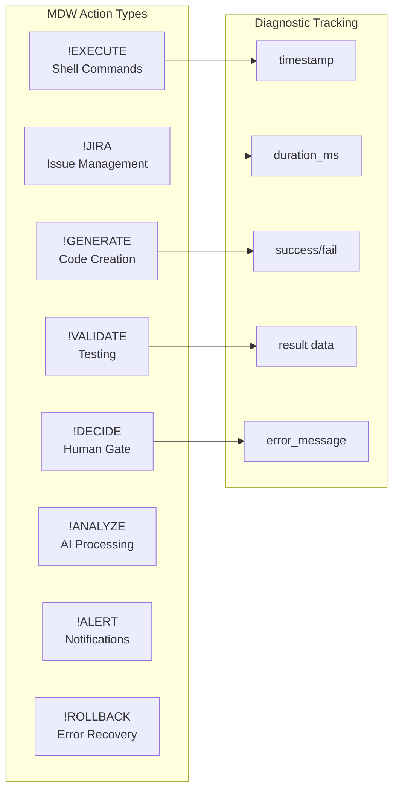
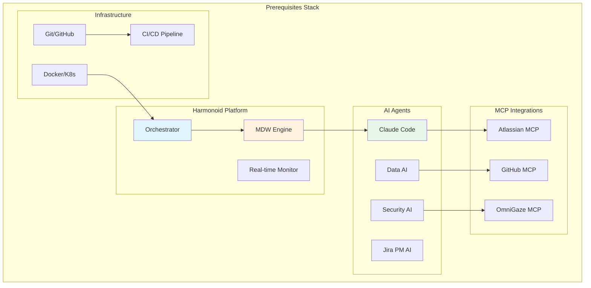

# AI-Driven Process Automation Framework

```mermaid
graph TB
    subgraph "MDW Workflow Orchestration"
        MDW[Markdown Workflow<br/>.mdw file]
        AI[AI Agent Pool]
        HUMAN[Human-in-Loop<br/>Decision Points]
        EXEC[Execution Engine]
        
        MDW -->|Defines Tasks| EXEC
        EXEC -->|Delegates| AI
        AI -->|Requires Decision| HUMAN
        HUMAN -->|Provides Input| EXEC
        EXEC -->|Updates Progress| MDW
    end
    
    subgraph "Task Execution Loop"
        T1[Read Task<br/>from MDW]
        T2[AI Analysis]
        T3{Human<br/>Gate?}
        T4[Execute Action]
        T5[Update MDW<br/>Diagnostics]
        T6{More<br/>Tasks?}
        
        T1 --> T2
        T2 --> T3
        T3 -->|Yes| HUMAN2[Human Review]
        T3 -->|No| T4
        HUMAN2 --> T4
        T4 --> T5
        T5 --> T6
        T6 -->|Yes| T1
        T6 -->|No| COMPLETE[Workflow Complete]
    end
    
    style MDW fill:#e1f5fe
    style HUMAN fill:#fff3e0
    style AI fill:#e8f5e9
    style HUMAN2 fill:#fff3e0
```

```mermaid
sequenceDiagram
    participant MDW as MDW Document
    participant HAR as Harmonoid
    participant AI as AI Agent
    participant HUM as Human
    participant SYS as System
    
    MDW->>HAR: Load Workflow
    HAR->>HAR: Parse Actions
    
    loop For Each Action
        HAR->>AI: Execute Task
        AI->>SYS: Perform Operation
        SYS-->>AI: Return Result
        
        alt Requires Human Input
            AI->>HUM: Request Decision
            HUM->>AI: Provide Input
        end
        
        AI->>MDW: Update Diagnostics
        MDW->>MDW: Log Progress
    end
    
    HAR->>MDW: Generate Summary
    MDW->>HUM: Display Results
```

```mermaid
graph LR
    subgraph "Sandbox Environment Architecture"
        MAIN[Production<br/>Environment]
        SAND[Sandbox<br/>Container]
        TEST[Test Data]
        MOCK[Mock Services]
        
        MAIN -.->|Isolated| SAND
        SAND --> TEST
        SAND --> MOCK
        
        subgraph "Sandbox Components"
            C1[Docker Container]
            C2[Virtual Network]
            C3[Test Database]
            C4[Mock APIs]
            C5[Performance Monitor]
            
            C1 --> C2
            C2 --> C3
            C3 --> C4
            C4 --> C5
        end
    end
    
    style MAIN fill:#ffebee
    style SAND fill:#e8f5e9
```

```mermaid
flowchart TB
    subgraph "AI Automation Phases"
        subgraph "Phase 1: Requirements"
            R1[Jira Ticket]
            R2[Email Analysis]
            R3[Doc Mining]
            R1 --> R2 --> R3
        end
        
        subgraph "Phase 2: Implementation"
            I1[Generate Code]
            I2[Run Tests]
            I3{Tests Pass?}
            I4[Fix Issues]
            
            I1 --> I2 --> I3
            I3 -->|No| I4
            I4 --> I2
            I3 -->|Yes| I5[Build]
        end
        
        subgraph "Phase 3: Validation"
            V1[Lint Check]
            V2[Security Scan]
            V3[Performance Test]
            V4{Human<br/>Approve?}
            
            V1 --> V2 --> V3 --> V4
        end
        
        subgraph "Phase 4: Deployment"
            D1[Create PR]
            D2[Update Jira]
            D3[Deploy to Dev]
            D4[Monitor]
            
            D1 --> D2 --> D3 --> D4
        end
        
        R3 --> I1
        I5 --> V1
        V4 -->|Yes| D1
        V4 -->|No| I1
    end
    
    style R1 fill:#e3f2fd
    style I3 fill:#fff3e0
    style V4 fill:#fff3e0
```

```mermaid
stateDiagram-v2
    [*] --> Initialization
    
    Initialization --> TaskAnalysis
    
    TaskAnalysis --> AIExecution
    TaskAnalysis --> HumanDecision: Requires Input
    
    AIExecution --> Testing
    HumanDecision --> AIExecution: Input Provided
    HumanDecision --> Abort: Rejected
    
    Testing --> Success: Pass
    Testing --> ErrorHandling: Fail
    
    ErrorHandling --> SelfCorrection
    SelfCorrection --> AIExecution: Retry
    SelfCorrection --> HumanIntervention: Can't Fix
    
    HumanIntervention --> AIExecution: Fixed
    HumanIntervention --> Abort: Cancel
    
    Success --> Documentation
    Documentation --> [*]
    
    Abort --> Rollback
    Rollback --> [*]
```

```mermaid
graph TB
    subgraph "Self-Improving Loop"
        TASK[New Task]
        KB[Knowledge Base]
        PATTERN[Pattern Recognition]
        SOLUTION[Solution Generation]
        TEST[Automated Testing]
        LEARN[Learning Module]
        
        TASK --> PATTERN
        KB --> PATTERN
        PATTERN --> SOLUTION
        SOLUTION --> TEST
        TEST -->|Success| LEARN
        TEST -->|Failure| SOLUTION
        LEARN --> KB
        LEARN --> NEXT[Next Task]
        
        NEXT -.->|Improved| TASK
    end
    
    subgraph "Performance Metrics"
        M1[Success Rate]
        M2[Speed Improvement]
        M3[Error Reduction]
        M4[Human Interventions]
        
        LEARN --> M1
        LEARN --> M2
        LEARN --> M3
        LEARN --> M4
    end
    
    style KB fill:#f3e5f5
    style LEARN fill:#e8f5e9
```

```mermaid
flowchart LR
    subgraph "MDW Action Types"
        A1[!EXECUTE<br/>Shell Commands]
        A2[!JIRA<br/>Issue Management]
        A3[!GENERATE<br/>Code Creation]
        A4[!VALIDATE<br/>Testing]
        A5[!DECIDE<br/>Human Gate]
        A6[!ANALYZE<br/>AI Processing]
        A7[!ALERT<br/>Notifications]
        A8[!ROLLBACK<br/>Error Recovery]
    end
    
    subgraph "Diagnostic Tracking"
        D1[timestamp]
        D2[duration_ms]
        D3[success/fail]
        D4[result data]
        D5[error_message]
    end
    
    A1 --> D1
    A2 --> D2
    A3 --> D3
    A4 --> D4
    A5 --> D5
```

```mermaid
graph TB
    subgraph "Prerequisites Stack"
        subgraph "Infrastructure"
            DOCKER[Docker/K8s]
            GIT[Git/GitHub]
            CI[CI/CD Pipeline]
        end
        
        subgraph "Harmonoid Platform"
            ORCH[Orchestrator]
            MDWENG[MDW Engine]
            MONITOR[Real-time Monitor]
        end
        
        subgraph "AI Agents"
            CLAUDE[Claude Code]
            DATA[Data AI]
            SEC[Security AI]
            PM[Jira PM AI]
        end
        
        subgraph "MCP Integrations"
            MCP1[Atlassian MCP]
            MCP2[GitHub MCP]
            MCP3[OmniGaze MCP]
        end
        
        DOCKER --> ORCH
        GIT --> CI
        ORCH --> MDWENG
        MDWENG --> CLAUDE
        CLAUDE --> MCP1
        DATA --> MCP2
        SEC --> MCP3
    end
    
    style ORCH fill:#e1f5fe
    style MDWENG fill:#fff3e0
    style CLAUDE fill:#e8f5e9
```