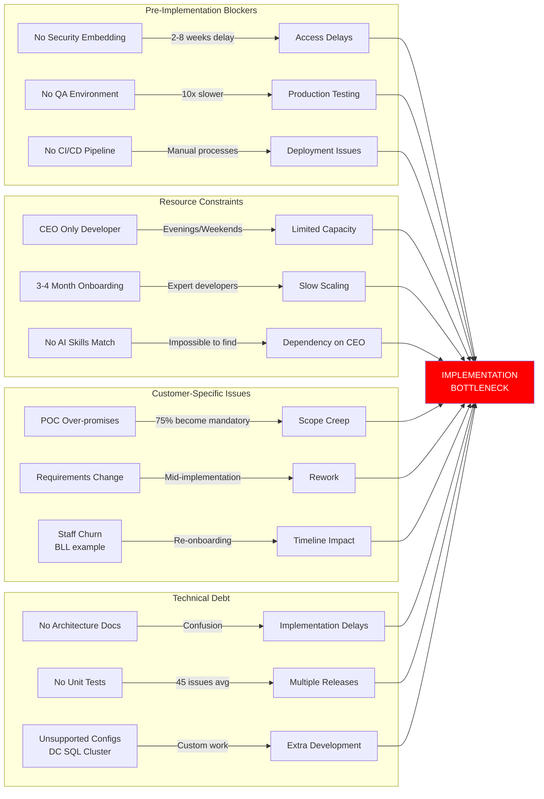
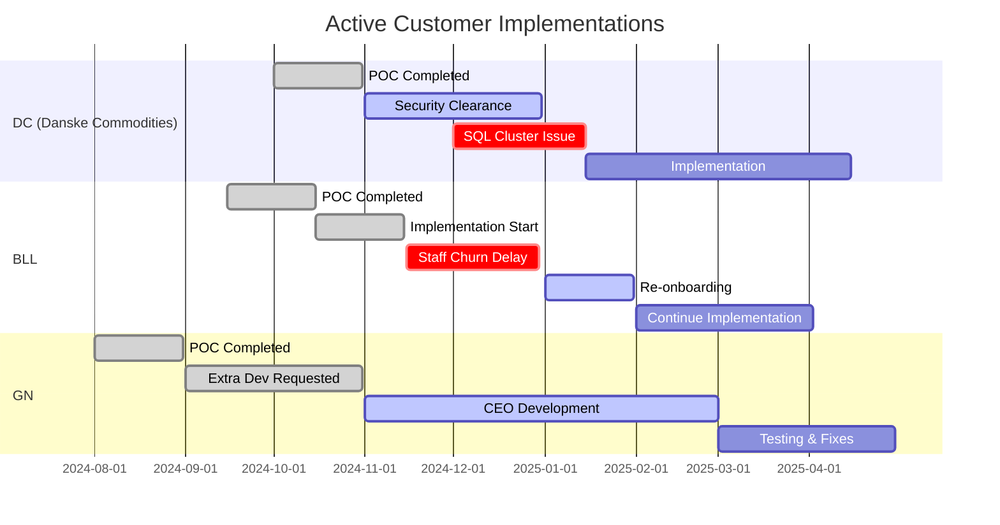
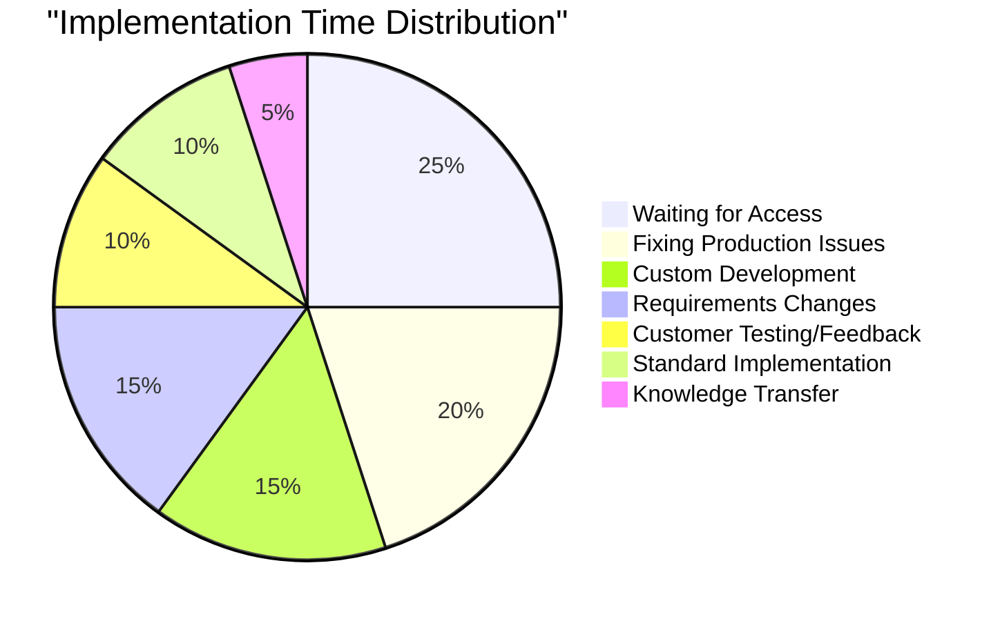
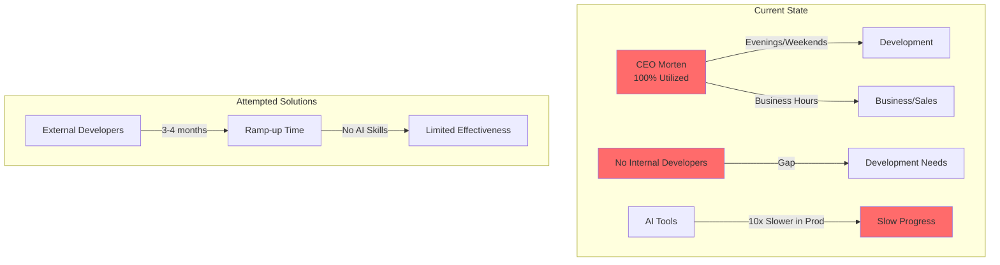

# OmniGaze Lead-to-Cash Pipeline: POC/Implementation Bottleneck Analysis

## Executive Summary

The implementation phase represents the most significant bottleneck in OmniGaze's lead-to-cash pipeline, with multiple compounding factors creating delays and resource constraints. Current implementations (DC, BLL, GN) are experiencing significant challenges due to resource limitations, and customer-side complexities.

## Current State: Complete Lead-to-Cash Pipeline

```mermaid
graph TB
    subgraph "Lead Generation"
        L1[Inbound/Outbound] --> L2[Initial Qualify]
        L2 --> L3{Qualified?}
        L3 -->|No| L4[Nurture]
        L3 -->|Yes| D1
    end

    subgraph "Discovery & Solution Design"
        D1[Discovery Meeting<br/>1-2 weeks] --> D2[Technical Deep Dive]
        D2 --> D3[Solution Architecture]
        D3 --> D4[Proposal Creation]
        D4 --> D5{Proposal Accepted?}
        D5 -->|No| D6[Revise]
        D6 --> D4
        D5 -->|Yes| P1
    end

    subgraph "POC Phase"
        P1[POC Planning<br/>Week 0] --> P2[Environment Setup<br/>Week 1]
        P2 --> P3[Core Validation<br/>Week 2]
        P3 --> P4[Advanced Scenarios<br/>Week 3]
        P4 --> P5[Final Report<br/>Week 4]
        P5 --> P6{POC Success?}
        P6 -->|No| END1[End]
        P6 -->|Yes| N1
    end

    subgraph "Negotiation & Contract"
        N1[Terms Negotiation] --> N2[Pricing Finalization]
        N2 --> N3[Legal Review]
        N3 --> N4[Contract Signing]
        N4 --> N5[PO Process]
        N5 --> I1
    end

    subgraph "IMPLEMENTATION PHASE - MAJOR BOTTLENECK"
        I1[Kickoff<br/>Week 1] --> I2{Security<br/>Clearance?}
        I2 -->|No| I3[Wait for Access<br/>2-8 weeks]
        I3 --> I2
        I2 -->|Yes| I4[Environment Access]
        
        I4 --> I5[Design Phase<br/>Weeks 2-3]
        I5 --> I6[Integration Dev<br/>Weeks 4-6]
        
        I6 --> I7{Custom<br/>Requirements?}
        I7 -->|Yes| I8[CEO Coding<br/>Evenings/Weekends]
        I8 --> I9[AI Development<br/>10x slower without QA]
        I7 -->|No| I10[Standard Deploy]
        
        I9 --> I11[Customer Testing]
        I10 --> I11
        
        I11 --> I12{Issues Found?}
        I12 -->|Yes 45 issues avg| I13[Fix & Redeploy<br/>20 releases avg]
        I13 --> I11
        I12 -->|No| I14[UAT]
        
        I14 --> I15{Requirements<br/>Changed?}
        I15 -->|Yes 75%| I16[Scope Adjustment]
        I16 --> I6
        I15 -->|No| I17[Go-Live]
        
        I17 --> I18[Knowledge Transfer<br/>Weeks 11-12]
        I18 --> I19[Project Closure]
    end

    subgraph "Payment & Support"
        I19 --> PA1[Invoice Generation]
        PA1 --> PA2[Payment Collection]
        PA2 --> PA3[Customer Success]
    end

    style I1 fill:#ff6b6b
    style I2 fill:#ff6b6b
    style I3 fill:#ff6b6b
    style I8 fill:#ff6b6b
    style I9 fill:#ff6b6b
    style I12 fill:#ff6b6b
    style I13 fill:#ff6b6b
    style I15 fill:#ff6b6b
```

## Implementation Phase: Detailed Bottleneck Analysis

## Current Customer Implementation Status

## Bottleneck Impact Analysis

## Resource Utilization Crisis

## Recommended Solutions

### Immediate Actions (0-30 days)

1. **Emergency QA Environment Setup**
   - Priority: CRITICAL
   - Cost: ~$50K
   - Impact: 10x speed improvement
   - Action: Provision onprem/cloud-based datacenter environment/simulation immediately. Postpone all current POC's and development efforts

2. **Security Fast-Track Process**
   - Early contact with customer security teams during POC phase
   - Create security clearance checklist
   - Start access requests before contract signing

3. **Scope Management Framework**
   - Document all POC statements explicitly and do weekly reviews/status meetings with OmniGaze customer success team. Not dev team
   - Create change request process with pricing
   - Set clear boundaries on included features

### Short-term Solutions (1-3 months)

4. **CI/CD Pipeline Implementation**
   - Build server setup
   - Augment automated testing framework
   - Deployment automation
   - Expected efficiency gain: 40%

5. **Speed enhancement Sprint**
   - Augment unit tests for critical paths
   - Automatic update feature architecture documentation
   - Augment integration test suite
   - Document SQL cluster support requirements

6. **Rapid Developer Onboarding**
   - Hire 2 senior developers immediately
   - Create AI-assisted development training program
   - Pair programming with CEO/CTO for knowledge transfer

### Medium-term Solutions (3-6 months)

7. **Productization Initiative**
   - Analyze common customer requests
   - Build configurable features vs. custom code
   - Create feature toggle system
   - Reduce custom development by 60%

8. **Partner Enablement Program**
   - Train partners on implementation
   - Create implementation playbooks
   - Establish certified partner network
   - Offload 50% of standard implementations

9. **Customer Success Process**
   - Dedicated implementation PM role
   - Standardized project templates
   - Automated status reporting
   - Proactive issue management

### Long-term Strategic Solutions (6-12 months)

10. **Platform Architecture Evolution**
    - Support for Windows Failover Clusters
    - Enhanced configuration flexibility
    - Self-service deployment options
    - API-first architecture

11. **AI Development Platform**
    - Internal AI coding environment
    - Closed-loop testing system
    - Knowledge base for AI context
    - 10x productivity improvement

12. **Implementation Factory Model**
    - Standardized implementation packages
    - Tiered service levels
    - Automated deployment scripts
    - Target: 4-week implementations

## ROI Analysis of Solutions

| Solution | Investment | Time Saved | ROI Period | Priority |
|----------|-----------|------------|------------|----------|
| QA Environment | $50K | 10x speed | 1 month | CRITICAL |
| CI/CD Pipeline | $30K | 40% efficiency | 2 months | HIGH |
| 2 Senior Devs | $400K/year | CEO time freed | 6 months | CRITICAL |
| Partner Program | $100K | 50% offload | 4 months | HIGH |

## Success Metrics

### Implementation Phase KPIs
- Average implementation time: Target < 8 weeks (current: 12-16 weeks)
- Number of production releases: Target < 5 (current: 20)
- Issues found in production: Target < 10 (current: 45)
- CEO development hours: Target 0 (current: 20+ hrs/week)
- Customer requirement changes: Target < 2 (current: 75% change rate)

### Quarterly Targets
- Q1 2026: QA environment operational, 2 developers hired
- Q2 2026: CI/CD fully implemented, first partner trained
- Q3 2026: 3 successful partner implementations
- Q4 2026: Average implementation time < 8 weeks

## Risk Mitigation

### Critical Risks
1. **CEO Burnout**: Currently working evenings/weekends - unsustainable
   - Mitigation: Immediate developer hiring, even at premium rates

2. **Customer Churn**: Long implementations risk losing customers
   - Mitigation: Set realistic expectations, provide regular updates

3. **Quality Issues**: 45 issues per implementation damages reputation
   - Mitigation: QA environment + automated testing urgent

4. **Scaling Inability**: Cannot grow with current model
   - Mitigation: Partner program + productization essential

## Conclusion

The implementation phase bottleneck threatens OmniGaze's growth and sustainability. The CEO coding on evenings/weekends is unsustainable, and the lack of QA environment creates a 10x productivity penalty. Immediate action on QA environment setup and developer hiring is critical for survival. The recommended solutions provide a clear path from crisis to scalable operations within 12 months.

---

*Document Created*: September 2025  
*Status*: CRITICAL - Immediate Action Required  
*Owner*: Executive Team