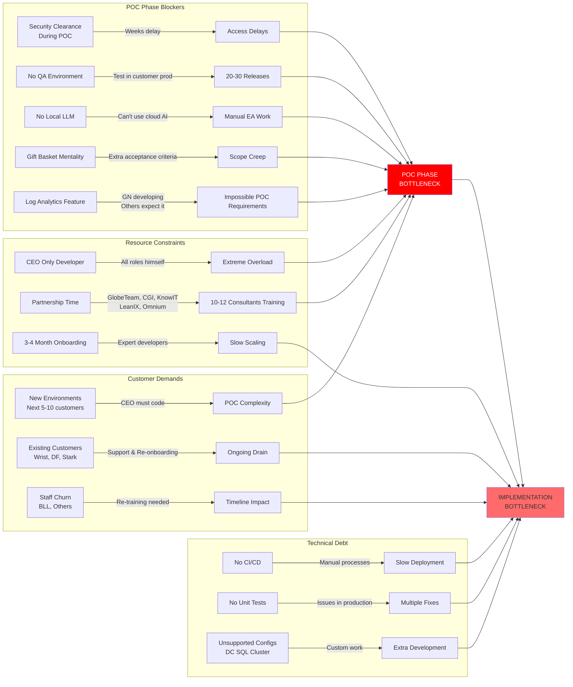
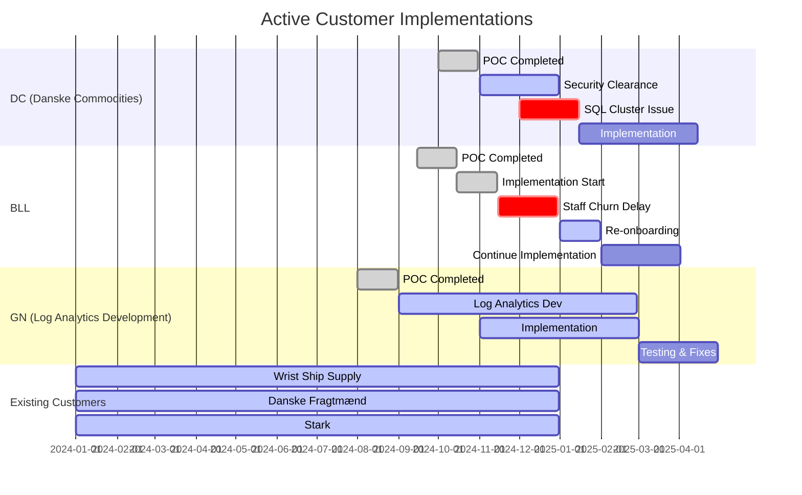
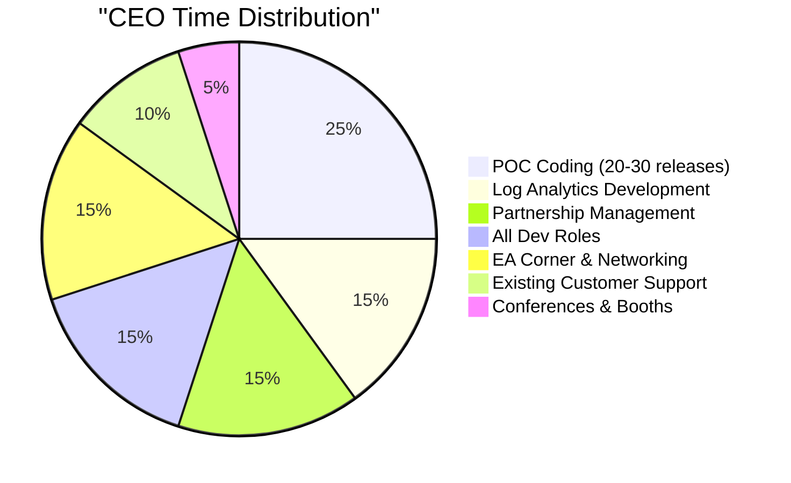
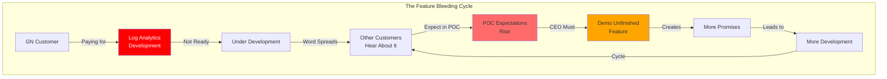
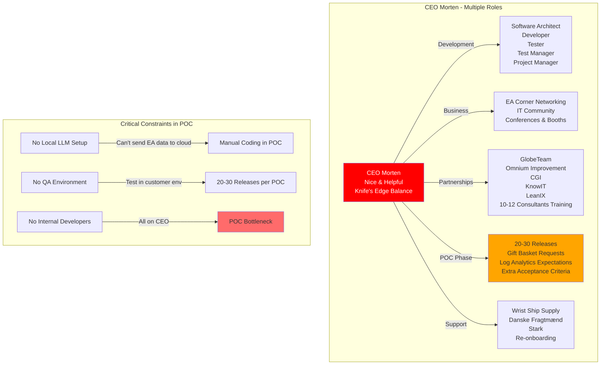

# OmniGaze Lead-to-Cash Pipeline: Implementation Bottleneck Analysis

## Executive Summary

Both the POC and implementation phases represent critical bottlenecks in OmniGaze's lead-to-cash pipeline. The POC phase requires actual coding and scanning to validate scenarios in new environments (expected for next 5-10 customers). A major emerging bottleneck is the Log Analytics feature being developed with GN - other customers now expect this unfinished feature in their POCs, creating impossible expectations. The implementation phase compounds these challenges with resource constraints - the CEO handles all software development roles while also managing partnerships, networking, and certifications. Additionally, existing paying customers (Wrist Ship Supply, Danske Fragtmænd, Stark) require ongoing support, re-onboarding, and feedback handling, further straining resources.

## Current State: Complete Lead-to-Cash Pipeline

```mermaid
graph TB
    subgraph "Lead Generation"
        L1[Inbound/Outbound] --> L2[Initial Qualify]
        L2 --> L3{Qualified?}
        L3 -->|No| L4[Nurture]
        L3 -->|Yes| D1
    end

    subgraph "Discovery & Solution Design"
        D1[Discovery Meeting<br/>1-2 weeks] --> D2[Technical Deep Dive]
        D2 --> D3[Solution Architecture]
        D3 --> D4[Proposal Creation]
        D4 --> D5{Proposal Accepted?}
        D5 -->|No| D6[Revise]
        D6 --> D4
        D5 -->|Yes| P1
    end

    subgraph "POC Phase - 4 Weeks - MAJOR BOTTLENECK"
        P1[POC Planning] --> P2{Security<br/>Clearance?}
        P2 -->|No| P3[Wait for Access<br/>Delays POC]
        P3 --> P2
        P2 -->|Yes| P4[Environment Setup<br/>Week 1]
        
        P4 --> P5[⚠️ CEO Coding<br/>New Environments]
        P5 --> P6[No Local LLM<br/>Can't Use Cloud<br/>EA Data Sensitive]
        P6 --> P7[Log Analytics<br/>Expected but<br/>Not Ready]
        P7 --> P8[20-30 Releases<br/>Gift Basket Mentality]
        P8 --> P9[Extra Acceptance<br/>Criteria Added]
        P9 --> P10{POC Success?}
        P10 -->|No| END1[End]
        P10 -->|Yes| N1
        
        style P2 fill:#ff6b6b
        style P3 fill:#ff6b6b
        style P5 fill:#ff6b6b
        style P6 fill:#ff6b6b
        style P7 fill:#ff0000,color:#fff
        style P8 fill:#ff6b6b
        style P9 fill:#ffa500
    end

    subgraph "Negotiation & Contract"
        N1[Terms Negotiation] --> N2[Pricing Finalization]
        N2 --> N3[Legal Review]
        N3 --> N4[Contract Signing]
        N4 --> N5[PO Process]
        N5 --> I1
    end

    subgraph "IMPLEMENTATION PHASE"
        I1[Kickoff<br/>Week 1] --> I4[Environment Access<br/>Already cleared in POC]
        
        I4 --> I5[Design Phase<br/>Weeks 2-3]
        I5 --> I6[Integration Dev<br/>Weeks 4-6]
        
        I6 --> I7{Custom Requirements?}
        I7 -->|Yes| I8[CEO Handles<br/>All Dev Roles]
        I7 -->|No| I10[Standard Deploy]
        
        I8 --> I11[Customer Testing]
        I10 --> I11
        
        I11 --> I12{Issues Found?}
        I12 -->|Yes| I13[Fix & Redeploy]
        I13 --> I11
        I12 -->|No| I14[UAT]
        
        I14 --> I17[Go-Live]
        
        I17 --> I18[Knowledge Transfer<br/>Weeks 11-12]
        I18 --> I19[Project Closure]
    end

    subgraph "Payment & Support"
        I19 --> PA1[Invoice Generation]
        PA1 --> PA2[Payment Collection]
        PA2 --> PA3[Customer Success]
    end

    style I8 fill:#ffa500
    style I12 fill:#ffa500
    style I13 fill:#ffa500
```

## POC & Implementation Bottleneck Analysis

## Current Customer Implementation Status

## Bottleneck Impact Analysis

## Feature Bleeding Problem

## CEO Role Overload Crisis

## Recommended Solutions

### Immediate Actions (0-30 days)

1. **Local LLM Infrastructure Setup**
   - Priority: CRITICAL
   - Deploy Ollama or similar for local AI processing
   - Enable EA data processing without cloud exposure
   - Augment all software development roles
   - Impact: Reduce POC releases from 20-30 to 5

2. **Emergency QA Environment Setup**
   - Priority: CRITICAL
   - Cost: ~$50K
   - Impact: No more testing in customer production
   - Action: Provision cloud-based datacenter simulation

3. **POC Boundary Management**
   - Define clear POC scope vs gift basket expectations
   - Explicitly state Log Analytics is "under development" not available
   - Start security clearance during sales phase
   - Leverage certified partners from GlobeTeam, CGI, KnowIT
   - CEO to set limits on special development

4. **Partner Activation**
   - Immediately activate trained consultants from partnerships
   - GlobeTeam, Omnium Improvement, CGI, KnowIT, LeanIX resources
   - Delegate POC delivery to certified consultants
   - CEO focuses only on critical architecture decisions

### Short-term Solutions (1-3 months)

5. **CI/CD Pipeline Implementation**
   - Build server setup
   - Automated testing framework
   - Deployment automation
   - Expected efficiency gain: 40%

6. **Strategic Developer Hiring**
   - Hire 2 senior developers immediately
   - Accept 3-4 month onboarding timeline
   - Focus on enterprise development skills over AI skills
   - CEO to delegate partnership activities during onboarding

7. **Partnership ROI Realization**
   - Activate investment in GlobeTeam, CGI, KnowIT partnerships
   - Deploy certified consultants to handle POCs
   - Reduce CEO involvement in POCs to < 20%
   - Focus partnerships on standard implementations

### Medium-term Solutions (3-6 months)

8. **Partner Enablement Program**
   - Train partners on implementation
   - Create implementation playbooks
   - Establish certified partner network
   - Offload 50% of standard implementations

9. **Customer Success Process**
   - Dedicated implementation PM role
   - Standardized project templates
   - Automated status reporting
   - Proactive issue management

### Long-term Strategic Solutions (6-12 months)

10. **Platform Architecture Evolution**
    - Support for Windows Failover Clusters
    - Enhanced configuration flexibility
    - Self-service deployment options
    - API-first architecture

11. **Local AI Development Platform**
    - On-premise LLM deployment for sensitive EA data
    - Closed-loop testing system
    - Local knowledge base for context
    - Enable AI augmentation for all dev roles
    - Target: Remove single-person bottleneck

12. **POC Factory Model**
    - Standardized POC packages
    - Clear boundaries on included features
    - Partner-led delivery
    - Target: 5 releases max per POC

## ROI Analysis of Solutions

| Solution | Investment | Time Saved | ROI Period | Priority |
|----------|-----------|------------|------------|----------|
| Local LLM Setup | $30K | 10x POC speed | 2 weeks | CRITICAL |
| QA Environment | $50K | Reduce POC releases from 20-30 to 5 | 1 month | CRITICAL |
| CI/CD Pipeline | $30K | 40% efficiency | 2 months | HIGH |
| 2 Senior Devs | $400K/year | CEO time freed | 6 months | CRITICAL |
| Partner Activation | $50K | Leverage existing training investment | Immediate | HIGH |

## Success Metrics

### Implementation Phase KPIs
- POC releases: Target < 5 (current: 20-30)
- POC duration with coding: Target 4 weeks (current: 4+ weeks with delays)
- Feature bleeding incidents: Target 0 (current: Log Analytics + others)
- Security clearance time: Target during sales (current: during POC)
- CEO POC involvement: Target < 20% (current: 100%)
- Partner POC delivery: Target 50% (current: 0%)
- Implementation time: Target < 8 weeks (current: 12-16 weeks)

### Quarterly Targets
- Q1 2025: QA environment operational, 2 developers hired
- Q2 2025: CI/CD fully implemented, first partner trained
- Q3 2025: 3 successful partner implementations
- Q4 2025: Average implementation time < 8 weeks

## Risk Mitigation

### Critical Risks
1. **CEO Burnout**: Handling all dev roles + partnerships + networking - unsustainable
   - Mitigation: Local LLM to augment all roles + immediate developer hiring

2. **Feature Bleeding Crisis**: Log Analytics being built for GN but expected by all
   - Impact: Every new POC expects unfinished features from other customers
   - Mitigation: Clear feature roadmap communication + "coming soon" messaging

3. **POC Gift Basket Syndrome**: Customers expect 20-30 releases and extra features
   - Mitigation: Clear POC boundaries + leverage partner consultants

4. **Existing Customer Drain**: Wrist, DF, Stark requiring ongoing support
   - Mitigation: Dedicated support team separate from development

5. **Scaling Inability**: Cannot grow with CEO as sole developer
   - Mitigation: Accept 3-4 month onboarding, focus on enterprise skills

## Conclusion

Both POC and implementation phases are bottlenecked by resource constraints and technical limitations. The Log Analytics feature bleeding from GN to other customer POCs exemplifies how product development and POC expectations have become dangerously intertwined. The CEO is overwhelmed handling all software development roles while managing partnerships, certifications, and networking. The inability to use cloud AI for sensitive EA data and lack of local LLM setup creates severe productivity penalties. Immediate action on local LLM deployment, QA environment setup, clear feature roadmap communication, and accepting the 3-4 month developer onboarding timeline is critical. The recommended solutions provide a path to sustainable operations within 12 months.

---

*Document Created*: January 2025  
*Status*: CRITICAL - Immediate Action Required  
*Owner*: Executive Team