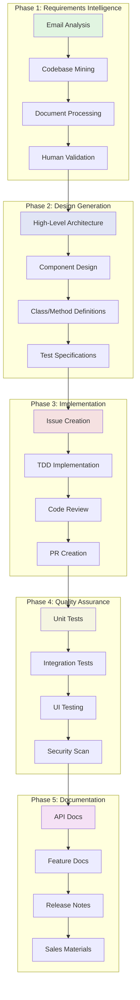

# AI-Driven Software Development Process

## Executive Summary
This document outlines OmniGaze's AI-augmented software development process, leveraging Harmonoid orchestration, MCP tooling, and automated quality gates to achieve 10x productivity gains while maintaining enterprise-grade quality.

## Process Philosophy
- **AI-First Development**: Every phase augmented by AI agents
- **Test-Driven by Design**: Tests precede implementation
- **Continuous Quality Gates**: Automated validation at every stage
- **Human-in-the-Loop**: Strategic intervention points for critical decisions
- **Knowledge Graph Integration**: All artifacts connected via MCP

## High-Level Process Flow

## Process Phases

### Phase 1: Requirements Intelligence
Automated gathering and synthesis of requirements from multiple sources

### Phase 2: Design Generation
AI-generated design documents at multiple abstraction levels

### Phase 3: Implementation
Issue-tracked, test-driven development with continuous integration

### Phase 4: Quality Assurance
Multi-layer testing with automated feedback loops

### Phase 5: Documentation
Comprehensive documentation updates across all touchpoints

## Key Differentiators

### 1. MCP Integration
- **Atlassian MCP**: Jira/Confluence automation
- **GitHub MCP**: Source control and CI/CD
- **OmniGaze MCP**: Platform-specific operations
- **Dinero MCP**: Financial and billing integration

### 2. Harmonoid Orchestration
- Real-time AI agent coordination
- Human intervention management
- Team-based development workflows
- Token usage optimization

### 3. Quality Gates
- Automated test generation
- Security vulnerability scanning
- Performance benchmarking
- Compliance validation

## Success Metrics
- **Velocity**: 10x productivity improvement
- **Quality**: <1% defect escape rate
- **Coverage**: >90% test coverage
- **Automation**: 95% process automation
- **Time-to-Market**: 70% reduction

## Navigation
- [Phase 1: Requirements Intelligence](01-requirements-intelligence.md)
- [Phase 2: Design Generation](02-design-generation.md)
- [Phase 3: Implementation](03-implementation.md)
- [Phase 4: Quality Assurance](04-quality-assurance.md)
- [Phase 5: Documentation](05-documentation.md)
- [Tools & Infrastructure](06-tools-infrastructure.md)
- [Metrics & Monitoring](07-metrics-monitoring.md)