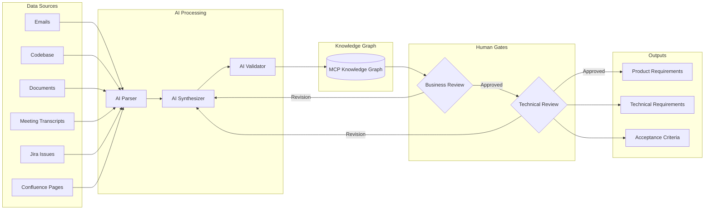
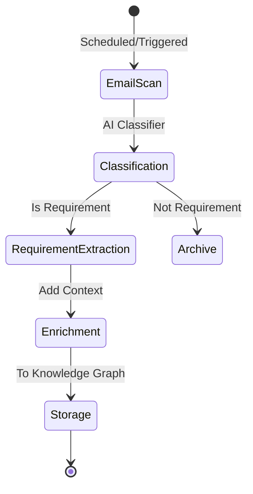
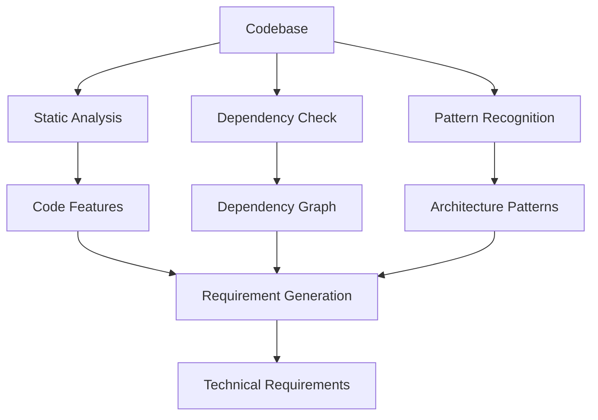
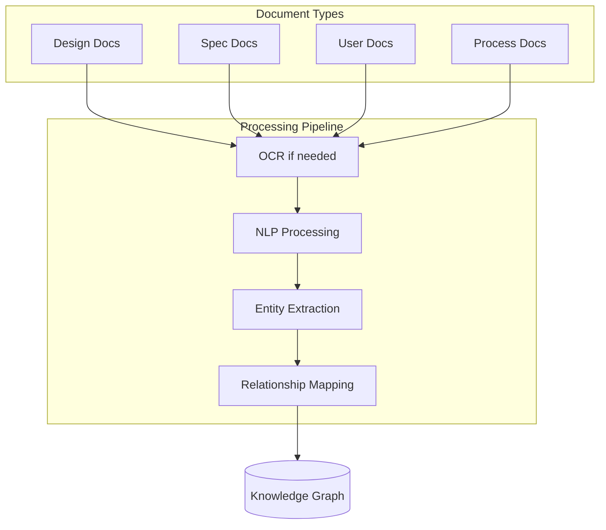
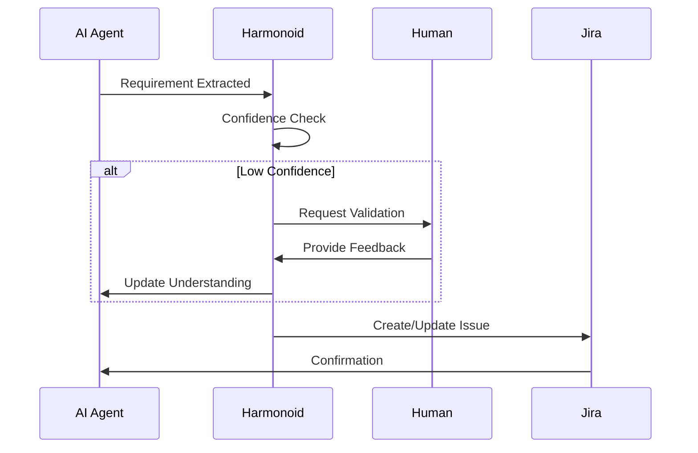

# Phase 1: Requirements Intelligence

## Overview
AI-driven requirements gathering and synthesis from multiple sources, creating a comprehensive understanding of development needs.

## Process Flow



## Sub-Processes

### 1.1 Email Mining


**Tools & Technologies:**
- **MCP Integration**: OmniGaze Internal MCP for email access
- **AI Models**: Claude/GPT-4 for classification and extraction
- **Storage**: Graph database with relationship mapping

### 1.2 Codebase Analysis


**Automated Discovery:**
- Existing functionality mapping
- API contract analysis
- Database schema understanding
- Configuration requirements

### 1.3 Document Processing


### 1.4 Human Intervention Points



## Data Sources Detail

### Email Sources
- Customer requests
- Internal discussions
- Support tickets
- Feature proposals
- Bug reports

### Codebase Sources
- Existing implementations
- TODO comments
- Deprecated markers
- Performance bottlenecks
- Security vulnerabilities

### Document Sources
- Product specifications
- Architecture documents
- API documentation
- User manuals
- Compliance requirements

### Meeting Transcripts
- Strategy discussions
- Sprint planning
- Customer feedback sessions
- Technical reviews
- Retrospectives

## AI Agents Configuration

### Requirements Parser Agent
```yaml
name: Requirements Parser
model: claude-3-opus
temperature: 0.3
context:
  - Domain knowledge
  - Company terminology
  - Technical constraints
tools:
  - Email reader (MCP)
  - Document parser
  - Code analyzer
  - NLP processor
```

### Requirements Synthesizer Agent
```yaml
name: Requirements Synthesizer
model: gpt-4-turbo
temperature: 0.5
context:
  - All parsed requirements
  - Business objectives
  - Technical landscape
tools:
  - Knowledge graph query
  - Conflict resolver
  - Priority scorer
  - Dependency mapper
```

## Quality Gates

### Gate 1: Completeness Check
- All user stories have acceptance criteria
- Technical requirements have implementation notes
- Dependencies are identified
- Risks are documented

### Gate 2: Consistency Check
- No conflicting requirements
- Alignment with existing systems
- Compliance with standards
- Resource availability confirmed

### Gate 3: Feasibility Check
- Technical feasibility validated
- Timeline realistic
- Budget constraints met
- Skills available

## Output Artifacts

### Product Requirements Document (PRD)
```markdown
# Feature: [Name]
## Overview
## User Stories
## Acceptance Criteria
## Dependencies
## Risks
## Success Metrics
```

### Technical Requirements Document (TRD)
```markdown
# Technical Specification: [Name]
## Architecture Impact
## API Changes
## Database Changes
## Security Considerations
## Performance Requirements
## Testing Strategy
```

## Metrics & KPIs

| Metric | Target | Measurement |
|--------|--------|-------------|
| Requirement Extraction Rate | 95% | Auto-extracted vs Manual |
| Processing Time | <2 hours | End-to-end per feature |
| Human Intervention | <20% | Automated vs Manual decisions |
| Requirement Quality | >90% | Post-implementation validation |
| Traceability | 100% | Requirements to implementation |

## Integration Points

### Jira Integration
- Automatic epic/story creation
- Requirement linking
- Acceptance criteria population
- Dependency mapping

### Confluence Integration
- PRD publication
- TRD storage
- Review workflows
- Version control

### GitHub Integration
- Requirement branches
- Issue linking
- Commit association
- PR templates

## Next Phase
[Phase 2: Design Generation →](02-design-generation.md)