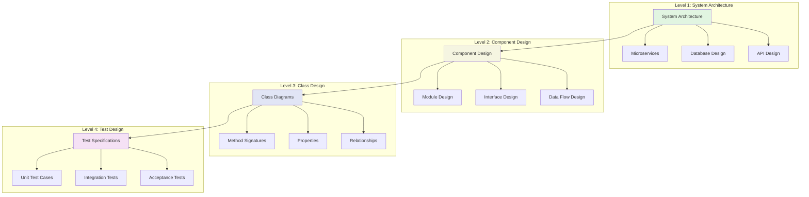
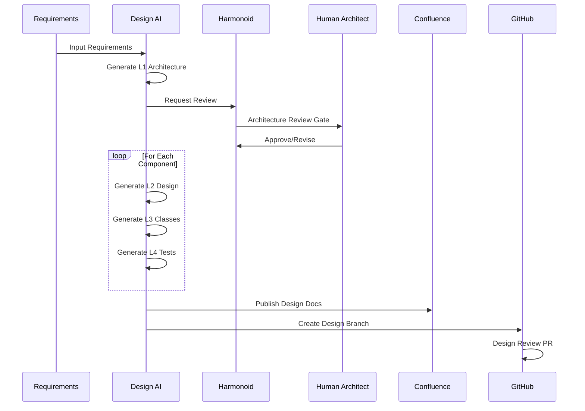
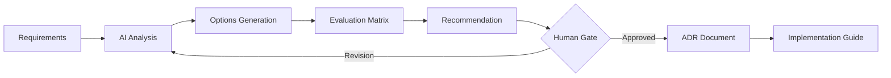
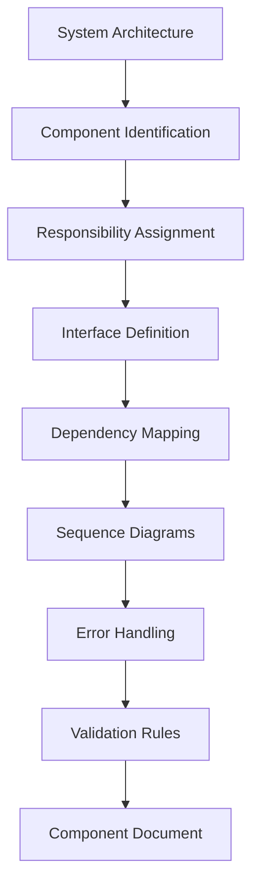
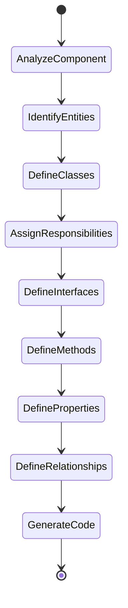
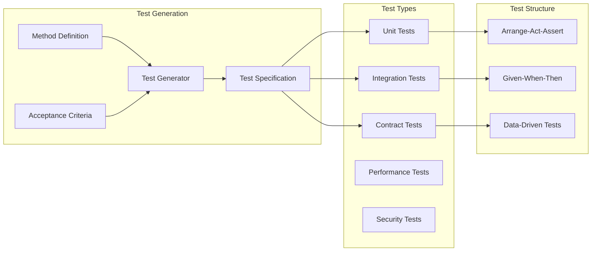
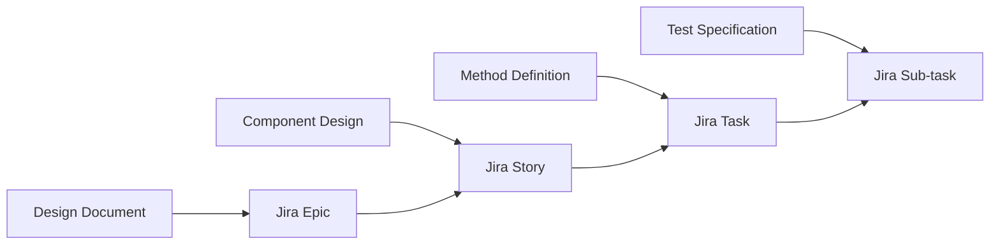

# Phase 2: Design Generation

## Overview
AI-generated design documents at multiple abstraction levels, from high-level architecture to detailed class and method definitions.

## Design Hierarchy



## Design Generation Process



## Level 1: System Architecture

### Architecture Decision Records (ADR)


### Generated Artifacts
```yaml
System Architecture Document:
  - Executive Summary
  - System Context
  - Container Diagram
  - Component Diagram
  - Deployment Diagram
  - Technology Stack
  - Non-Functional Requirements
  - Security Architecture
  - Integration Points
  - Migration Strategy
```

## Level 2: Component Design

### Component Generation Pipeline


### Component Specification Template
```typescript
interface ComponentSpecification {
  name: string;
  responsibility: string;
  interfaces: {
    provided: Interface[];
    required: Interface[];
  };
  data: {
    models: DataModel[];
    stores: DataStore[];
  };
  behavior: {
    workflows: Workflow[];
    statemachines: StateMachine[];
  };
  quality: {
    performance: PerformanceReq[];
    security: SecurityReq[];
    reliability: ReliabilityReq[];
  };
}
```

## Level 3: Class & Method Design

### Class Generation Strategy


### Method Definition Standard
```csharp
/// <summary>
/// [AI-Generated Summary]
/// </summary>
/// <param name="paramName">[Description]</param>
/// <returns>[Return description]</returns>
/// <exception cref="ExceptionType">[When thrown]</exception>
/// <remarks>
/// Performance: O(n)
/// Thread-Safety: [Yes/No]
/// Side-Effects: [None/Description]
/// </remarks>
public ReturnType MethodName(ParameterType paramName)
{
    // Implementation will be generated in Phase 3
    throw new NotImplementedException("TDD: Test First");
}
```

## Level 4: Test Specifications

### Test Generation Framework


### Test Specification Example
```csharp
[TestClass]
public class ComponentNameTests
{
    [TestMethod]
    [TestCategory("Unit")]
    [DataRow(/* test data */)]
    public void MethodName_WhenCondition_ShouldExpectedBehavior()
    {
        // Arrange
        var sut = new SystemUnderTest();
        var input = TestDataBuilder.Build();
        
        // Act
        var result = sut.MethodName(input);
        
        // Assert
        Assert.IsNotNull(result);
        Assert.AreEqual(expected, result);
    }
}
```

## AI Agent Configuration

### Architecture Generator
```yaml
name: Architecture Generator
model: claude-3-opus
temperature: 0.4
context:
  - System requirements
  - Existing architecture
  - Technology constraints
  - Best practices
tools:
  - PlantUML generator
  - C4 model creator
  - ADR writer
  - Pattern matcher
```

### Class Designer
```yaml
name: Class Designer
model: gpt-4-turbo
temperature: 0.3
context:
  - Component specifications
  - Design patterns
  - SOLID principles
  - Domain model
tools:
  - UML generator
  - Code skeleton creator
  - Interface designer
  - Relationship mapper
```

## Quality Gates

### Design Review Checklist
- [ ] Meets all functional requirements
- [ ] Non-functional requirements addressed
- [ ] Follows established patterns
- [ ] Security considerations included
- [ ] Performance implications analyzed
- [ ] Scalability plan defined
- [ ] Migration path clear
- [ ] Test strategy comprehensive

### Human Intervention Points
1. **Architecture Approval**: System-level design decisions
2. **API Review**: External interface changes
3. **Database Schema**: Data model modifications
4. **Security Review**: Authentication/authorization design
5. **Performance Review**: Critical path optimizations

## Output Artifacts

### Design Package Contents
```
/design
  /architecture
    - system-context.puml
    - container-diagram.puml
    - component-diagram.puml
    - deployment-diagram.puml
    - architecture-decisions.md
  /components
    - component-1-design.md
    - component-2-design.md
    - sequence-diagrams.puml
  /classes
    - class-diagrams.puml
    - interface-definitions.cs
    - method-signatures.cs
  /tests
    - test-specifications.md
    - test-cases.yaml
    - test-data.json
  /api
    - openapi-spec.yaml
    - postman-collection.json
  /database
    - schema.sql
    - migration-scripts.sql
```

## Integration with Development Tools

### Jira Integration


### GitHub Integration
- Design branch creation
- Design review PRs
- Design documentation in wiki
- Issue templates from design

### Confluence Integration
- Auto-publish design documents
- Version control for designs
- Review workflows
- Stakeholder comments

## Metrics & KPIs

| Metric | Target | Measurement |
|--------|--------|-------------|
| Design Generation Time | <4 hours | Per component |
| Design Quality Score | >85% | Review checklist |
| First-Time Approval | >70% | Human review pass rate |
| Design-to-Code Alignment | >95% | Implementation match |
| Test Coverage Design | 100% | Methods with test specs |

## Next Phase
[Phase 3: Implementation →](03-implementation.md)