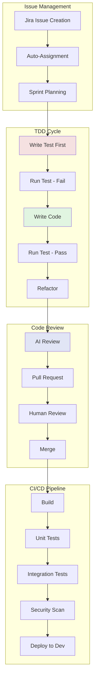
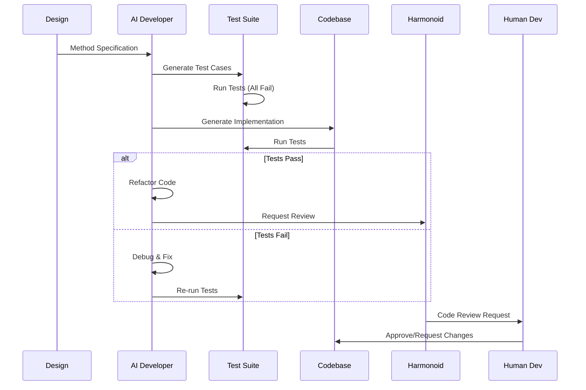
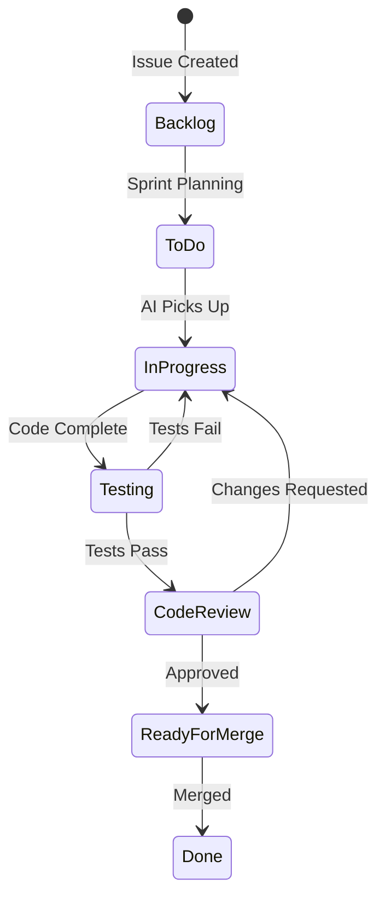
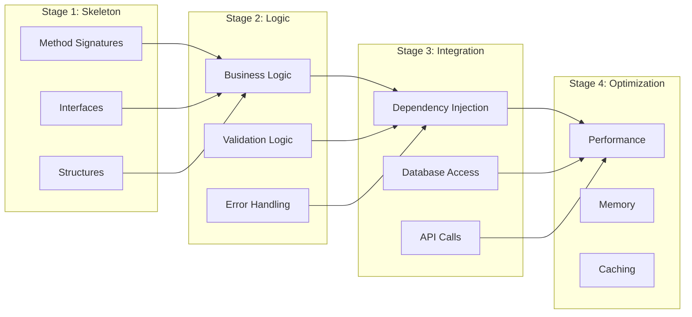
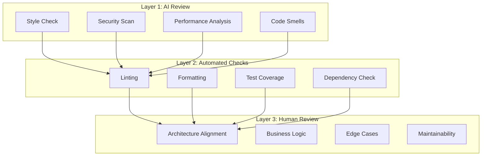
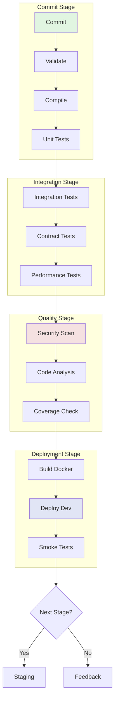
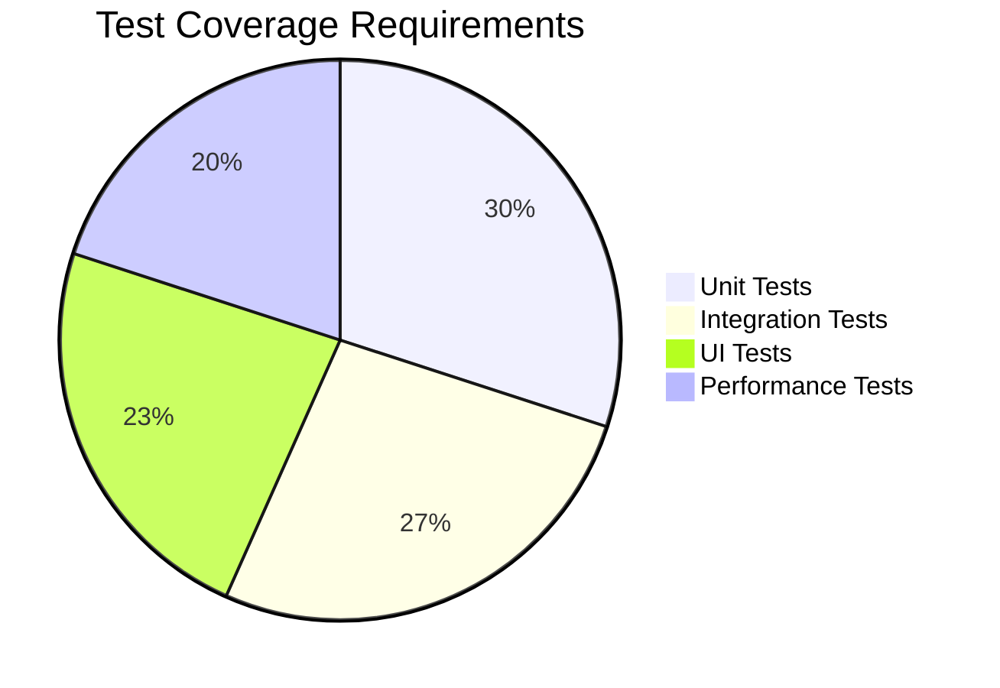
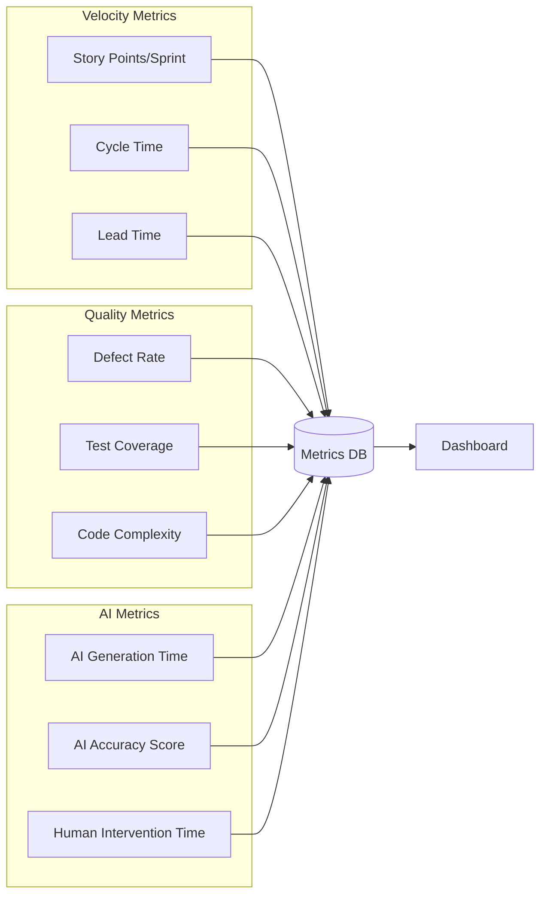

# Phase 3: Implementation

## Overview
Issue-tracked, test-driven development with AI-powered code generation, continuous integration, and automated quality checks.

## Implementation Flow



## Test-Driven Development Process

### TDD Workflow with AI


### Test Generation Strategy
```typescript
interface TestGenerationStrategy {
  unitTests: {
    happyPath: TestCase[];
    edgeCases: TestCase[];
    errorCases: TestCase[];
    boundaryTests: TestCase[];
  };
  integrationTests: {
    apiTests: TestCase[];
    databaseTests: TestCase[];
    serviceTests: TestCase[];
  };
  propertyTests: {
    invariants: PropertyTest[];
    generators: DataGenerator[];
  };
}
```

## Issue Tracking Integration

### Jira Workflow


### Issue Template
```yaml
Issue:
  Type: Task
  Title: "[Component] Implement {MethodName}"
  Description: |
    ## Specification
    {Design reference}
    
    ## Acceptance Criteria
    - [ ] All unit tests pass
    - [ ] Integration tests pass
    - [ ] Code coverage >90%
    - [ ] No security vulnerabilities
    - [ ] Performance benchmarks met
    
  Labels: [ai-development, tdd]
  Components: [{Component}]
  Epic: {Epic Link}
  Story Points: {AI Estimated}
  Assignee: AI-Developer-{ID}
```

## Code Generation Pipeline

### AI Code Generator Configuration
```yaml
name: Code Generator
model: claude-3-opus
temperature: 0.2
context:
  - Design specifications
  - Existing codebase
  - Coding standards
  - Test requirements
tools:
  - AST parser
  - Pattern matcher
  - Dependency resolver
  - Code formatter
principles:
  - SOLID
  - DRY
  - YAGNI
  - Clean Code
```

### Implementation Stages


## Code Review Process

### Multi-Layer Review


### Pull Request Template
```markdown
## Description
{AI-generated summary of changes}

## Type of Change
- [ ] Bug fix
- [ ] New feature
- [ ] Breaking change
- [ ] Documentation update

## Testing
- [ ] Unit tests pass
- [ ] Integration tests pass
- [ ] Manual testing completed

## Checklist
- [ ] Code follows style guidelines
- [ ] Self-review completed
- [ ] Comments added where necessary
- [ ] Documentation updated
- [ ] No new warnings
- [ ] Tests added/updated
- [ ] Security scan passed

## Performance Impact
{AI-generated performance analysis}

## Related Issues
- Fixes #{issue}
- Related to #{epic}
```

## Continuous Integration Pipeline

### CI/CD Workflow


### GitHub Actions Configuration
```yaml
name: CI Pipeline
on:
  pull_request:
    types: [opened, synchronize]

jobs:
  test:
    runs-on: ubuntu-latest
    steps:
      - uses: actions/checkout@v3
      - name: Setup .NET
        uses: actions/setup-dotnet@v3
      - name: Run Tests
        run: dotnet test --coverage
      - name: Security Scan
        uses: omnigaze/security-scanner@v1
      - name: Performance Check
        run: dotnet run --project perf-tests
      
  ai-review:
    runs-on: ubuntu-latest
    steps:
      - name: AI Code Review
        uses: omnigaze/ai-reviewer@v1
        with:
          model: claude-3-opus
          checks: all
```

## Quality Gates

### Gate 1: Test Coverage


### Gate 2: Code Quality
- Cyclomatic complexity < 10
- Code duplication < 3%
- Technical debt ratio < 5%
- Maintainability index > 70

### Gate 3: Security
- No high/critical vulnerabilities
- OWASP Top 10 compliance
- Dependency vulnerabilities resolved
- Secrets scanning passed

## Monitoring & Metrics

### Development Metrics Dashboard


## Integration Points

### MCP Tool Integration
```yaml
Atlassian MCP:
  - Create/update Jira issues
  - Link commits to issues
  - Update sprint progress
  - Generate release notes

GitHub MCP:
  - Create branches
  - Open pull requests
  - Trigger workflows
  - Manage releases

OmniGaze MCP:
  - Update knowledge graph
  - Track dependencies
  - Monitor performance
  - Collect metrics
```

## Success Criteria

| Metric | Target | Current |
|--------|--------|---------|
| AI Code Generation | 80% | - |
| First-Time Test Pass | 70% | - |
| PR Approval Rate | 90% | - |
| Deployment Frequency | Daily | - |
| Mean Time to Recovery | <1 hour | - |
| Code Review Time | <30 min | - |

## Next Phase
[Phase 4: Quality Assurance →](04-quality-assurance.md)