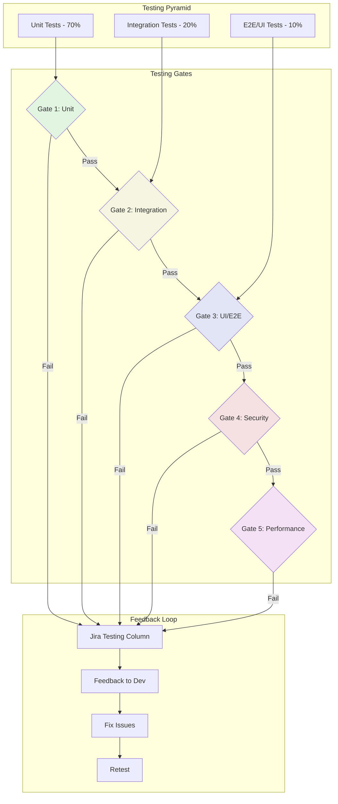
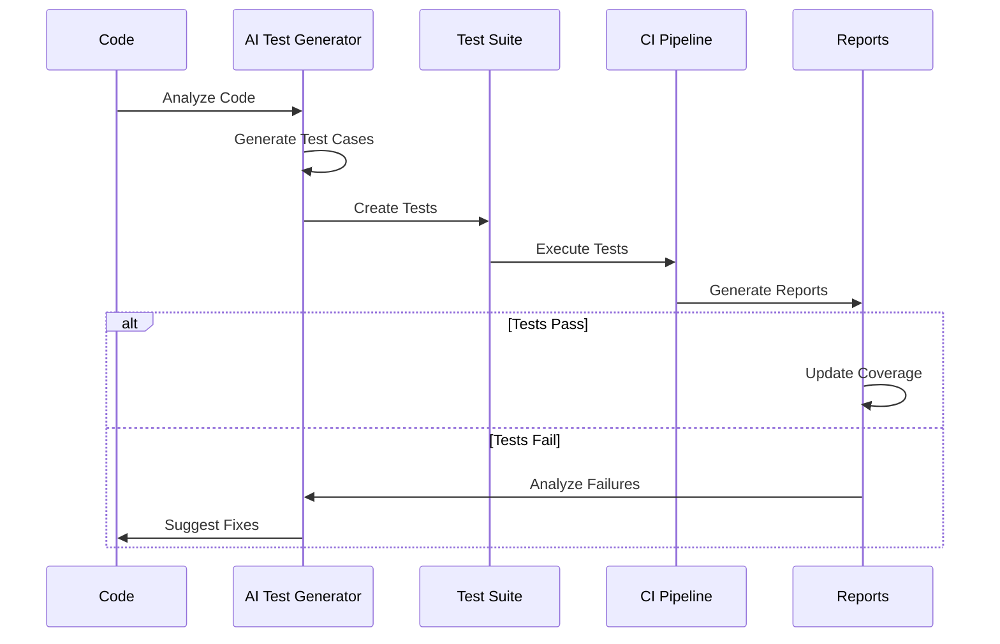
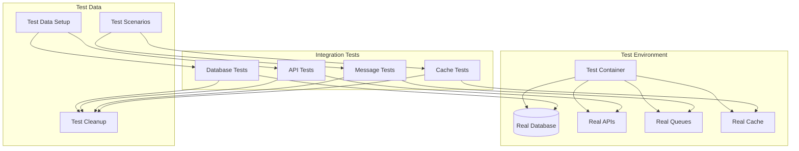
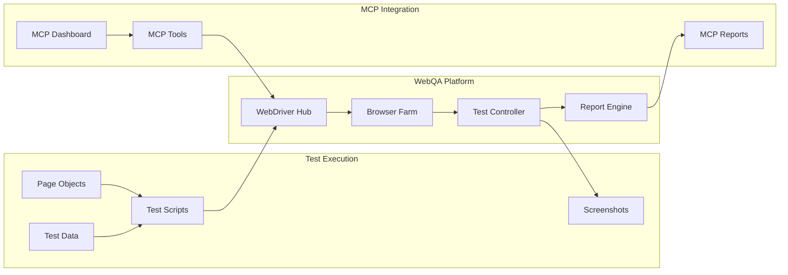
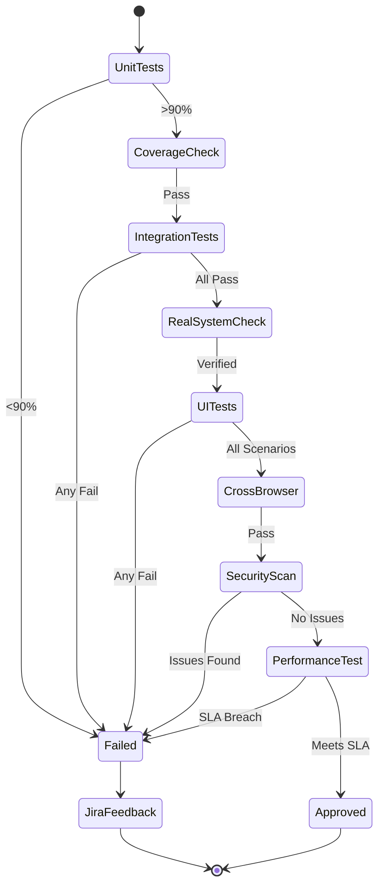
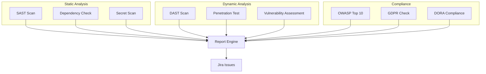
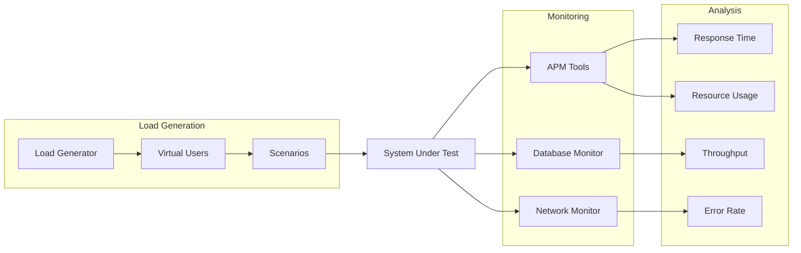
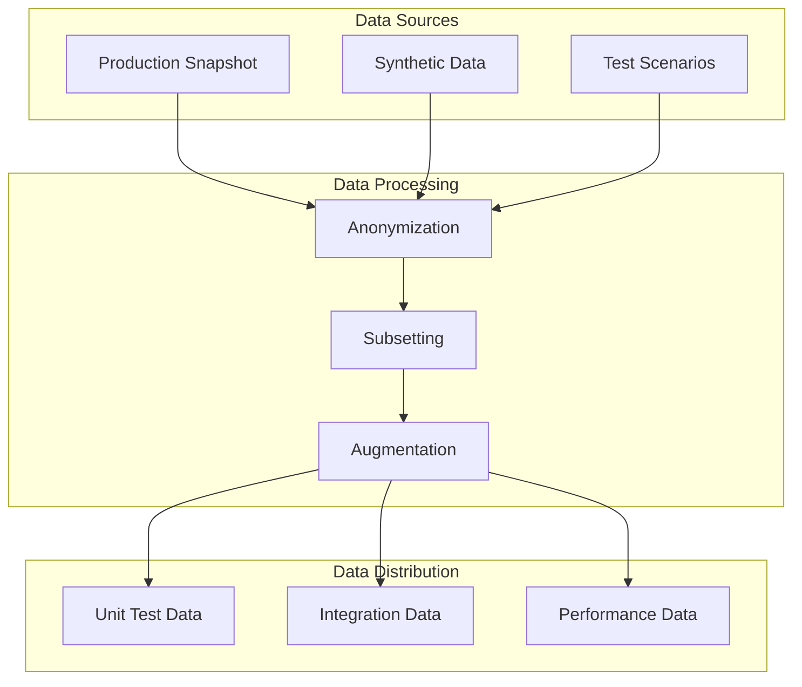
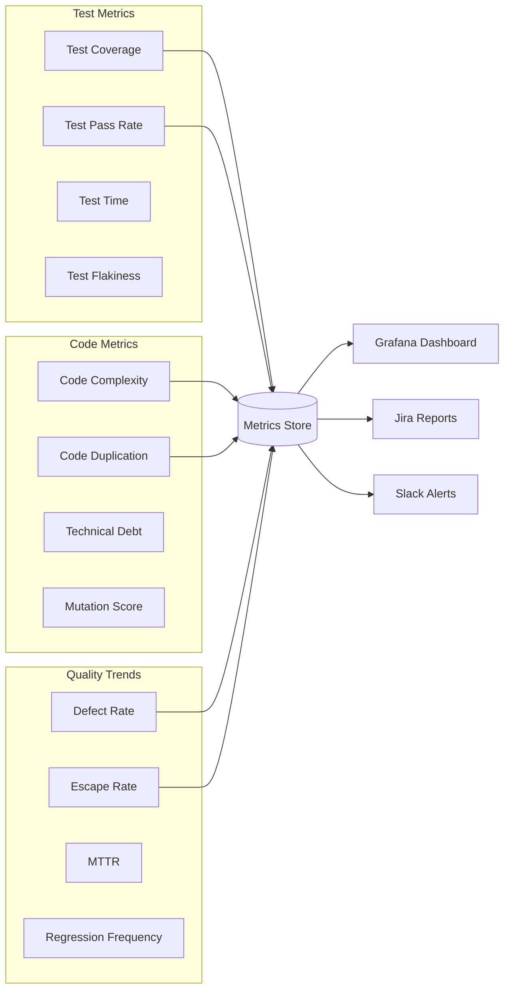

# Phase 4: Quality Assurance

## Overview
Multi-layer testing strategy with automated quality gates, real-world integration testing (no mocks), and comprehensive UI testing through WebQA tools.

## Quality Assurance Architecture



## Unit Testing Strategy

### Test Generation & Execution


### Unit Test Standards
```csharp
[TestClass]
public class ComponentTests
{
    [TestInitialize]
    public void Setup()
    {
        // Arrange - Common setup
    }
    
    [TestMethod]
    [TestCategory("Unit")]
    [Priority(1)]
    public void Method_GivenValidInput_ReturnsExpectedResult()
    {
        // Arrange
        var input = TestData.ValidInput;
        var expected = TestData.ExpectedOutput;
        
        // Act
        var actual = Component.Method(input);
        
        // Assert
        Assert.AreEqual(expected, actual);
        Assert.That.ExecutionTime.IsLessThan(100);
    }
    
    [TestMethod]
    [TestCategory("Unit")]
    [ExpectedException(typeof(ArgumentException))]
    public void Method_GivenInvalidInput_ThrowsException()
    {
        // Arrange
        var input = TestData.InvalidInput;
        
        // Act & Assert
        Component.Method(input);
    }
}
```

## Integration Testing (No Mocks)

### Real Integration Architecture


### Integration Test Example
```csharp
[TestClass]
[TestCategory("Integration")]
public class RealDatabaseIntegrationTests
{
    private static IDbConnection _connection;
    private static IServiceProvider _services;
    
    [ClassInitialize]
    public static void ClassSetup(TestContext context)
    {
        // Use real database connection
        _connection = new SqlConnection(TestConfig.RealDbConnection);
        
        // Setup real services
        _services = new ServiceCollection()
            .AddRealDatabase()
            .AddRealMessaging()
            .AddRealCaching()
            .BuildServiceProvider();
    }
    
    [TestMethod]
    public async Task CreateOrder_WithRealDatabase_PersistsCorrectly()
    {
        // Arrange - Real database transaction
        using var transaction = _connection.BeginTransaction();
        var order = TestData.CreateOrder();
        var repository = _services.GetService<IOrderRepository>();
        
        // Act - Real database operation
        var result = await repository.CreateAsync(order);
        await transaction.CommitAsync();
        
        // Assert - Query real database
        var saved = await repository.GetAsync(result.Id);
        Assert.IsNotNull(saved);
        Assert.AreEqual(order.TotalAmount, saved.TotalAmount);
        
        // Cleanup
        await repository.DeleteAsync(result.Id);
    }
}
```

## UI Testing with WebQA Tools

### WebQA Architecture (localhost:5050)


### UI Test Implementation
```typescript
describe('OmniGaze Portal UI Tests', () => {
    let driver: WebDriver;
    let portal: PortalPage;
    
    beforeEach(async () => {
        // Connect to WebQA hub
        driver = await new Builder()
            .usingServer('http://localhost:5050/wd/hub')
            .forBrowser('chrome')
            .build();
            
        portal = new PortalPage(driver);
        await portal.navigate();
    });
    
    test('User can view IT assets', async () => {
        // Arrange
        await portal.login(TestUsers.admin);
        
        // Act
        await portal.navigateToAssets();
        const assets = await portal.getAssetList();
        
        // Assert
        expect(assets.length).toBeGreaterThan(0);
        expect(await portal.isFilterVisible()).toBeTruthy();
        
        // Visual regression
        await driver.takeScreenshot('assets-page');
    });
    
    test('3D visualization loads correctly', async () => {
        // Arrange
        await portal.login(TestUsers.viewer);
        
        // Act
        await portal.open3DView();
        await portal.waitFor3DLoad();
        
        // Assert
        const canvas = await portal.get3DCanvas();
        expect(canvas).toBeDefined();
        expect(await portal.get3DNodeCount()).toBeGreaterThan(0);
        
        // Performance check
        const loadTime = await portal.get3DLoadTime();
        expect(loadTime).toBeLessThan(3000);
    });
});
```

## Testing Gates & Feedback

### Gate Configuration


### Jira Testing Column Integration
```yaml
Testing Column Workflow:
  Entry Criteria:
    - Code complete
    - Unit tests pass locally
    - PR approved
    
  Testing Process:
    - Automated test execution
    - Results posted to Jira
    - Screenshots attached
    - Performance metrics logged
    
  Exit Criteria:
    Success:
      - All gates passed
      - No P1/P2 defects
      - Performance within SLA
      
    Failure:
      - Create bug tickets
      - Link to original issue
      - Assign to developer
      - Move to "In Progress"
```

## Security Testing

### Security Scan Pipeline


## Performance Testing

### Performance Test Framework


### Performance Criteria
```yaml
Performance SLAs:
  API Response Times:
    p50: <100ms
    p95: <500ms
    p99: <1000ms
    
  Page Load Times:
    Initial: <2s
    Subsequent: <1s
    3D View: <3s
    
  Throughput:
    Concurrent Users: 1000
    Requests/sec: 5000
    
  Resource Usage:
    CPU: <70%
    Memory: <80%
    Database Connections: <100
```

## Test Data Management

### Test Data Strategy


## Quality Metrics Dashboard

### Real-time Metrics


## Success Metrics

| Metric | Target | Measurement |
|--------|--------|-------------|
| Test Coverage | >90% | Code coverage tools |
| Test Pass Rate | >95% | CI/CD metrics |
| Defect Escape Rate | <1% | Production vs QA defects |
| Test Execution Time | <30 min | Pipeline duration |
| False Positive Rate | <5% | Manual verification |
| Security Vulnerabilities | 0 Critical/High | Security scans |
| Performance SLA | 100% | APM monitoring |

## Next Phase
[Phase 5: Documentation →](05-documentation.md)