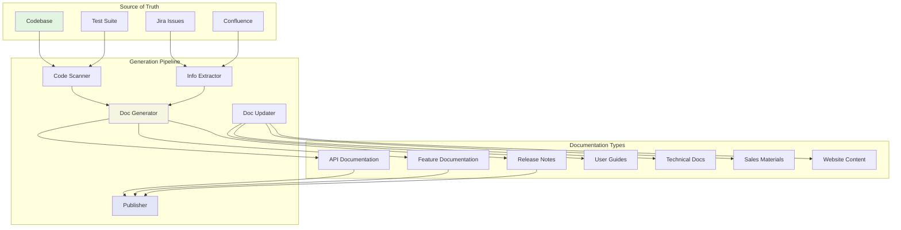
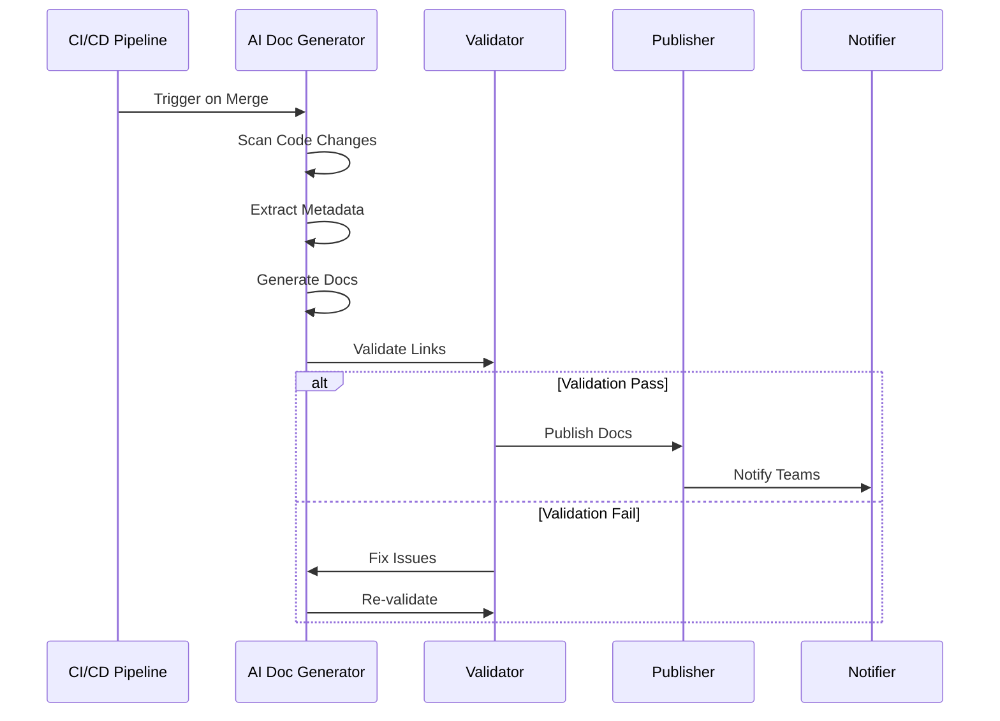
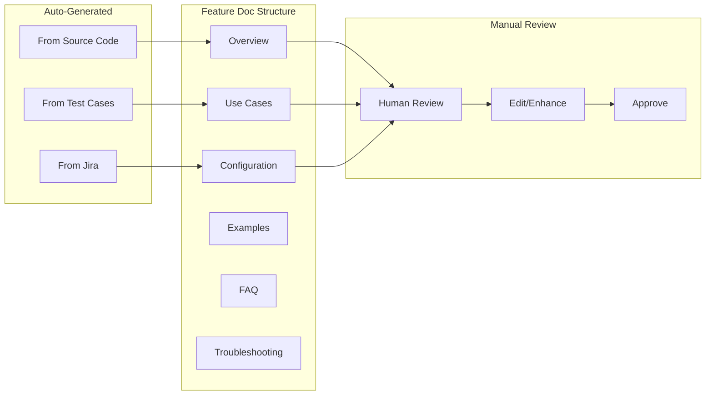
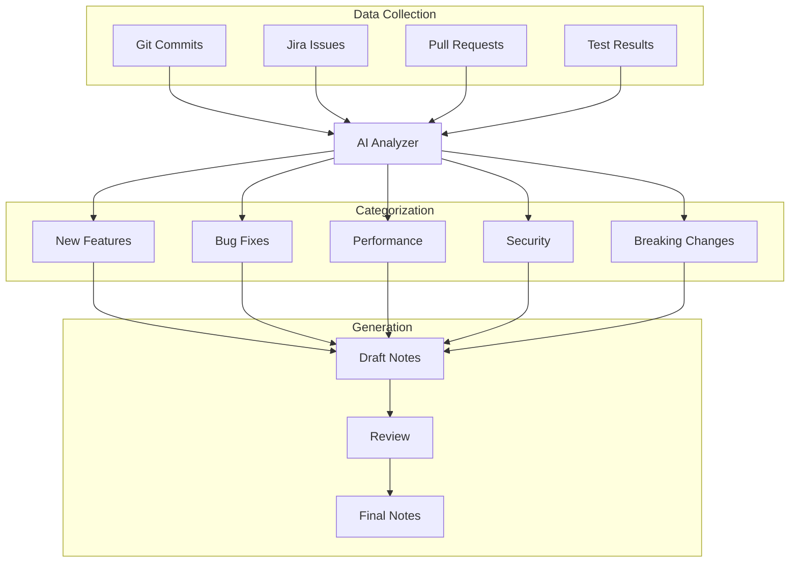
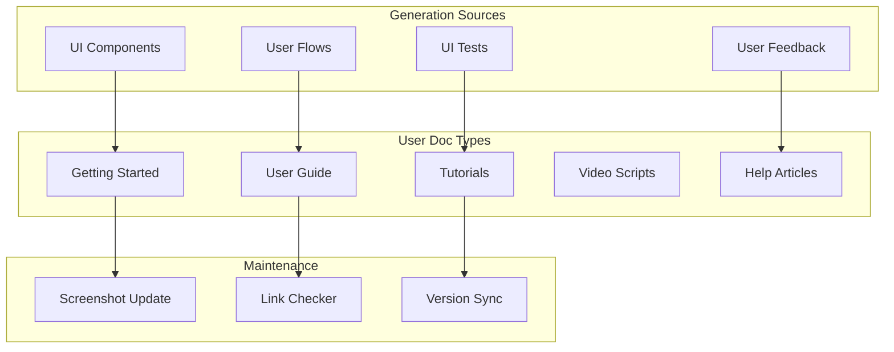
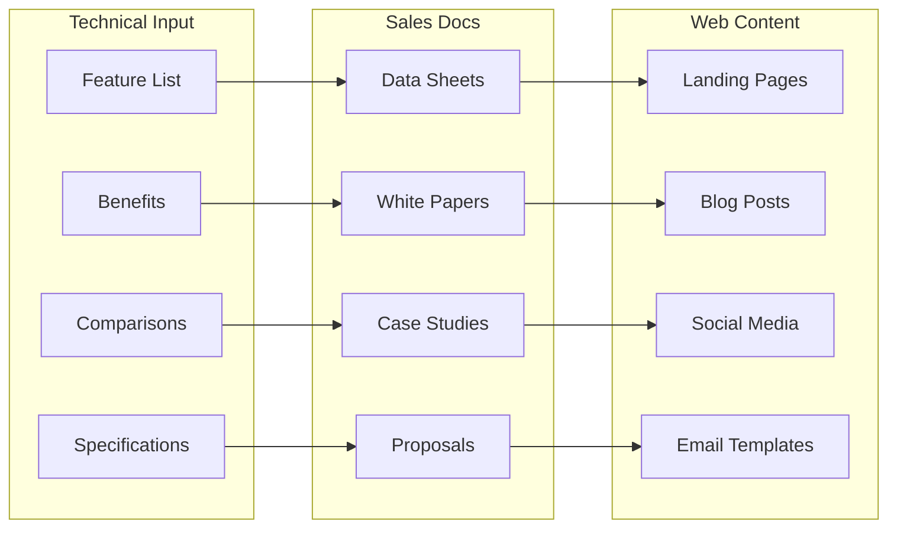
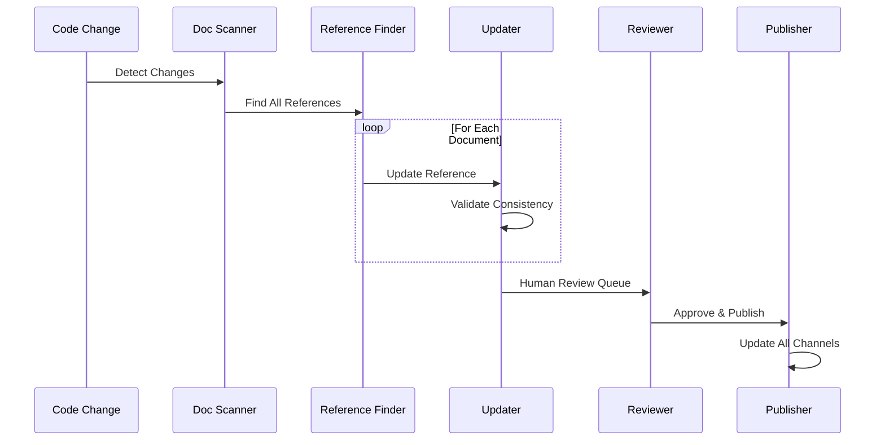
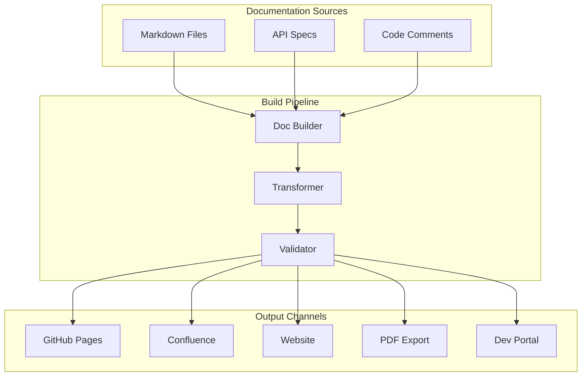
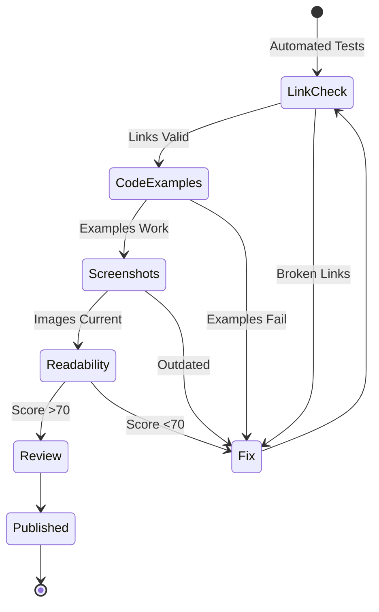
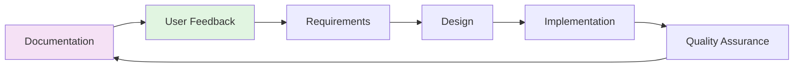

# Phase 5: Documentation

## Overview
Comprehensive documentation updates across all touchpoints, ensuring every document referring to implemented code is automatically updated, including feature docs, release notes, web pages, and sales materials.

## Documentation Architecture



## Documentation Generation Pipeline

### Automated Documentation Flow


## Documentation Types & Templates

### 1. API Documentation
```yaml
OpenAPI Specification:
  Generation:
    - Source: Code annotations
    - Tool: Swagger/OpenAPI generator
    - Trigger: On API change
    
  Content:
    - Endpoints
    - Request/Response schemas
    - Authentication
    - Error codes
    - Examples
    - Rate limits
    
  Publishing:
    - Swagger UI: /api/docs
    - Postman: Auto-sync
    - Developer Portal: portal.omnigaze.com/api
```

### API Doc Example
```csharp
/// <summary>
/// Retrieves IT assets based on filter criteria
/// </summary>
/// <param name="filter">Filter parameters</param>
/// <returns>Paginated list of assets</returns>
/// <response code="200">Assets retrieved successfully</response>
/// <response code="400">Invalid filter parameters</response>
/// <response code="401">Authentication required</response>
[HttpGet("assets")]
[ProducesResponseType(typeof(PagedResult<Asset>), 200)]
[ProducesResponseType(typeof(ErrorResponse), 400)]
public async Task<IActionResult> GetAssets([FromQuery] AssetFilter filter)
{
    // Implementation
}
```

### 2. Feature Documentation


### Feature Doc Template
```markdown
# Feature: {Feature Name}

## Overview
{AI-generated summary from code and requirements}

## Key Benefits
- {Extracted from Jira epic}
- {Derived from acceptance criteria}

## How It Works
{Generated from implementation}

## Configuration
```yaml
{Generated from config files}
```

## Use Cases
{Generated from test scenarios}

## API Reference
{Links to API documentation}

## Examples
{Generated from integration tests}

## Performance Considerations
{Extracted from performance tests}

## Security Notes
{From security scan results}

## Troubleshooting
{Common issues from test failures}

## Related Features
{Dependency graph links}
```

### 3. Release Notes


### Release Notes Template
```markdown
# Release v{version} - {date}

## 🎉 Highlights
{AI-generated executive summary}

## ✨ New Features
- **{Feature Name}** - {Description} ([#issue](link))
  - {Sub-feature details}
  - Performance: {metrics}

## 🐛 Bug Fixes
- Fixed {description} ([#issue](link))

## ⚡ Performance Improvements
- {Description} - {Before/After metrics}

## 🔒 Security Updates
- {CVE/Security fix description}

## 💔 Breaking Changes
- {What changed}
- Migration guide: {link}

## 📚 Documentation Updates
- {What was updated}

## 🔧 Technical Improvements
- {Internal improvements}

## 📊 Metrics
- Lines of code: {added/removed}
- Test coverage: {percentage}
- Performance benchmarks: {link}
```

### 4. User Documentation


### 5. Sales & Marketing Materials


## Documentation Update Workflow

### Automated Update Process


### Reference Tracking System
```yaml
Reference Graph:
  Code Elements:
    - Classes
    - Methods
    - APIs
    - Configuration
    
  Document References:
    - Direct mentions
    - Code examples
    - Screenshots
    - Diagrams
    
  Update Rules:
    - Signature changes → Update examples
    - Behavior changes → Update descriptions
    - Deprecation → Add warnings
    - Removal → Archive/redirect
```

## Publishing & Distribution

### Multi-Channel Publishing


### Documentation Portal Structure
```
portal.omnigaze.com/docs
├── /getting-started
│   ├── quickstart
│   ├── installation
│   └── first-steps
├── /api
│   ├── reference
│   ├── authentication
│   └── examples
├── /features
│   ├── asset-discovery
│   ├── visualization
│   └── reporting
├── /guides
│   ├── admin-guide
│   ├── user-guide
│   └── developer-guide
├── /releases
│   ├── current
│   ├── archive
│   └── roadmap
└── /support
    ├── faq
    ├── troubleshooting
    └── contact
```

## Quality Assurance for Documentation

### Documentation Testing


### Quality Metrics
```yaml
Documentation Quality:
  Coverage:
    - API Coverage: 100%
    - Feature Coverage: 100%
    - Test Coverage: >90%
    
  Accuracy:
    - Link Validity: 100%
    - Code Examples: 100% working
    - Screenshots: <30 days old
    
  Readability:
    - Flesch Score: >60
    - Technical Level: Appropriate
    - Structure: Consistent
    
  Maintenance:
    - Update Frequency: With each release
    - Review Cycle: Quarterly
    - User Feedback: Monthly
```

## Documentation AI Agents

### Doc Generator Agent
```yaml
name: Documentation Generator
model: claude-3-opus
temperature: 0.3
context:
  - Code changes
  - Existing docs
  - Style guide
  - User feedback
capabilities:
  - Generate API docs
  - Create examples
  - Write tutorials
  - Update references
```

### Doc Reviewer Agent
```yaml
name: Documentation Reviewer
model: gpt-4-turbo
temperature: 0.2
context:
  - Documentation standards
  - Technical accuracy
  - User perspective
capabilities:
  - Check consistency
  - Validate examples
  - Score readability
  - Suggest improvements
```

## Success Metrics

| Metric | Target | Measurement |
|--------|--------|-------------|
| Doc Coverage | 100% | Automated scanning |
| Update Latency | <24 hours | Time from code to docs |
| Accuracy | >99% | Validation tests |
| User Satisfaction | >4.5/5 | Feedback surveys |
| Search Success | >90% | Analytics |
| Time to Find | <2 min | User studies |
| Doc Build Time | <10 min | CI/CD metrics |

## Integration with Other Phases

### Feedback Loop


## Next Steps
- [Tools & Infrastructure →](06-tools-infrastructure.md)
- [Metrics & Monitoring →](07-metrics-monitoring.md)
- [Return to Overview](00-overview.md)