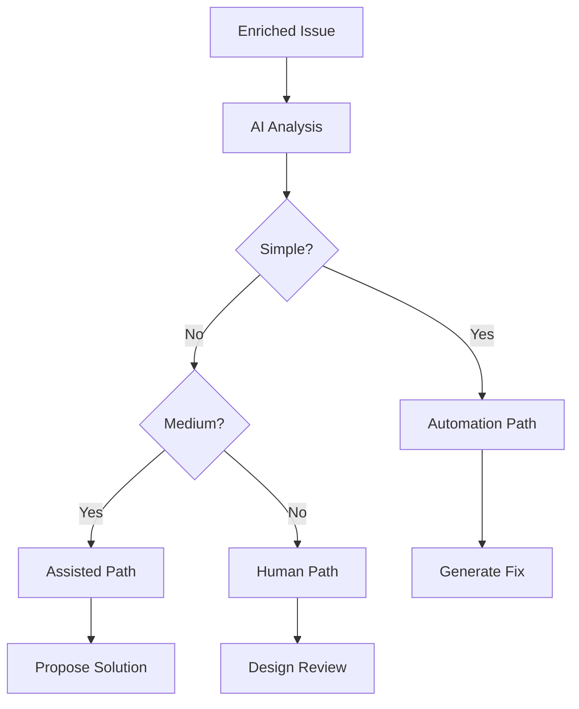
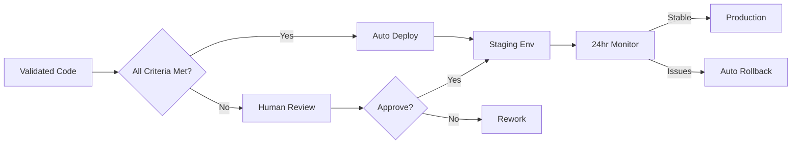

# Development Automation Playbook: 80/20 Implementation

## Executive Summary
This playbook implements the Pareto Principle across all development operations, automating 80% of routine tasks to free leadership bandwidth for strategic work. Target: 10x productivity improvement with maintained quality.

## Core Principle: The 80/20 Rule

### Philosophy
- **80% Automation**: Bug fixes, small features, routine tasks
- **20% Human Focus**: Complex design, architecture decisions, strategic planning

### Expected Outcomes
- **Morten**: 80% bandwidth recovered for strategy
- **John F.**: Focus on architecture and complex problems
- **John Web**: Handle operational management
- **Team**: 10x productivity improvement

## Issue Categorization Framework

### Complexity Assessment Matrix

#### Simple Issues (60% of total)
**Characteristics**:
- Single file changes
- Clear fix pattern
- No design decisions
- Under 50 lines of code
- Existing test coverage

**Automation**: Fully automated
**Human Touch**: None required
**Timeline**: <2 hours

#### Medium Issues (20% of total)
**Characteristics**:
- Multi-file changes
- Some logic required
- Minor design choices
- 50-200 lines of code
- Test generation needed

**Automation**: AI-assisted
**Human Touch**: Review only
**Timeline**: <8 hours

#### Complex Issues (20% of total)
**Characteristics**:
- Architecture changes
- Multiple system impacts
- Design decisions required
- 200+ lines of code
- New patterns needed

**Automation**: AI-supported
**Human Touch**: Full involvement
**Timeline**: 1-5 days

## Automated Development Pipeline

### Stage 1: Issue Enrichment
```yaml
Input: Jira Issue with basic description
Process:
  1. AI analyzes issue context
  2. Pulls relevant logs and metrics
  3. Identifies affected components
  4. Adds validation criteria
  5. Suggests complexity level
Output: Enriched issue with full context
```

### Stage 2: Complexity Routing


### Stage 3: Implementation

#### Automated Path (Simple Issues)
```python
class AutomatedImplementation:
    def process(self, issue):
        # 1. Generate solution
        solution = ai.generate_fix(issue)
        
        # 2. Validate against patterns
        if not validates_patterns(solution):
            return escalate_to_human()
        
        # 3. Generate tests
        tests = ai.generate_tests(solution)
        
        # 4. Run validation
        if all_tests_pass(tests):
            return auto_deploy(solution)
        else:
            return escalate_to_human()
```

#### Assisted Path (Medium Issues)
```python
class AssistedImplementation:
    def process(self, issue):
        # 1. AI proposes solution
        proposal = ai.propose_solution(issue)
        
        # 2. Human reviews proposal
        if human.approves(proposal):
            # 3. AI implements with oversight
            implementation = ai.implement(proposal)
            
            # 4. Human validates
            if human.validates(implementation):
                return deploy(implementation)
        
        return human_implementation(issue)
```

#### Human Path (Complex Issues)
```python
class HumanImplementation:
    def process(self, issue):
        # 1. AI provides analysis
        analysis = ai.analyze_complexity(issue)
        
        # 2. Human designs solution
        design = human.create_design(analysis)
        
        # 3. AI assists implementation
        code = ai.assist_coding(design)
        
        # 4. Full review cycle
        return standard_review_process(code)
```

### Stage 4: Validation & Testing

#### Automated Test Generation
```yaml
Test Strategy:
  Unit Tests:
    - AI generates from code changes
    - Coverage target: >90%
    - Mock generation: Automatic
    
  Integration Tests:
    - Template-based generation
    - Mock environment execution
    - No customer data required
    
  Regression Tests:
    - Automatic suite updates
    - Impact analysis-driven
    - Parallel execution
```

#### Mock Environment Setup
```yaml
Mock Infrastructure:
  Local Environment:
    - Docker containers
    - SNMP simulators
    - API mocks
    - Database stubs
    
  Data Generation:
    - Anonymized patterns
    - Synthetic datasets
    - Recorded interactions
    - Schema preservation
```

### Stage 5: Deployment

#### Auto-Deployment Criteria
- All tests passing
- No security vulnerabilities
- Performance within bounds
- Code quality metrics met
- No breaking changes detected

#### Deployment Paths


## XML Prompting Strategy

### Why XML?
- **Native Format**: Claude trained on XML/HTML
- **25% Performance Gain**: Better structure parsing
- **Reduced Hallucinations**: Clear boundaries
- **Better Consistency**: Predictable outputs

### Implementation Templates

#### Bug Fix Template
```xml
<task type="bug_fix">
  <issue>
    <id>JIRA-1234</id>
    <description>Null pointer exception in user service</description>
    <stack_trace>...</stack_trace>
  </issue>
  <context>
    <affected_files>UserService.cs, IUserRepository.cs</affected_files>
    <recent_changes>...</recent_changes>
  </context>
  <constraints>
    <patterns>Repository pattern, async/await</patterns>
    <standards>C# coding standards v2.0</standards>
  </constraints>
  <validation>
    <tests>Unit tests must pass</tests>
    <coverage>Maintain >90%</coverage>
  </validation>
</task>
```

#### Feature Implementation Template
```xml
<task type="feature">
  <requirement>
    <story>As a user, I want to export reports</story>
    <acceptance_criteria>
      <criterion>Support PDF export</criterion>
      <criterion>Support Excel export</criterion>
      <criterion>Maintain formatting</criterion>
    </acceptance_criteria>
  </requirement>
  <technical_context>
    <existing_patterns>IExporter interface</existing_patterns>
    <dependencies>iTextSharp, ClosedXML</dependencies>
  </technical_context>
  <implementation_guide>
    <approach>Strategy pattern for exporters</approach>
    <validation>Integration tests required</validation>
  </implementation_guide>
</task>
```

## Local LLM + Cloud Orchestration

### Architecture
```yaml
Cloud Layer (Claude Opus):
  Role: Orchestration and Intelligence
  Tasks:
    - Task planning and breakdown
    - Decision making
    - Result validation
    - Quality assurance
  
Local Layer (Ollama):
  Role: Data Processing
  Tasks:
    - Code analysis
    - Test execution
    - Data transformation
    - Security scanning
    
MCP Bridge:
  Role: Secure Interface
  Tasks:
    - Data anonymization
    - Schema management
    - Result aggregation
    - Audit logging
```

### Security Model
- Customer data never leaves local environment
- Only metadata sent to cloud
- All sensitive operations local
- Full audit trail maintained

## Implementation Roadmap

### Week 1-2: Foundation
- [ ] Set up issue enrichment pipeline
- [ ] Configure complexity routing
- [ ] Deploy local LLM infrastructure
- [ ] Create XML prompt templates

### Week 3-4: Automation Path
- [ ] Implement simple issue automation
- [ ] Deploy auto-test generation
- [ ] Set up mock environments
- [ ] Configure auto-deployment

### Week 5-6: Assisted Path
- [ ] Build proposal system
- [ ] Create review workflows
- [ ] Implement validation gates
- [ ] Deploy monitoring

### Week 7-8: Optimization
- [ ] Tune complexity detection
- [ ] Optimize prompt templates
- [ ] Enhance mock data
- [ ] Measure productivity gains

## Success Metrics

### Automation Metrics
| Metric | Baseline | Target | Timeline |
|--------|----------|--------|----------|
| Issues Auto-Resolved | 0% | 60% | 3 months |
| AI-Assisted Resolution | 0% | 20% | 3 months |
| Manual Resolution | 100% | 20% | 3 months |
| Average Fix Time | 2 days | 2 hours | 6 months |
| Test Coverage | 60% | 90% | 3 months |

### Quality Metrics
| Metric | Baseline | Target | Timeline |
|--------|----------|--------|----------|
| Bug Escape Rate | 10% | 2% | 6 months |
| Code Review Pass Rate | 70% | 95% | 3 months |
| Performance Regression | 5% | 0% | 6 months |
| Security Issues | Variable | 0 Critical | Immediate |

### Business Impact
| Metric | Baseline | Target | Timeline |
|--------|----------|--------|----------|
| Developer Productivity | 1x | 10x | 12 months |
| Time to Market | 6 months | 2 months | 12 months |
| Leadership in Operations | 80% | 20% | 3 months |
| Customer Satisfaction | 7/10 | 9/10 | 6 months |

## Risk Mitigation

### Technical Risks
| Risk | Mitigation |
|------|------------|
| AI generates bad code | Human review for complex items |
| Tests don't catch issues | Staged deployment with monitoring |
| Mock data insufficient | Continuous recording from production |
| Performance degradation | Automated performance testing |

### Process Risks
| Risk | Mitigation |
|------|------------|
| Team resistance | Gradual rollout with training |
| Over-automation | Maintain human oversight |
| Knowledge loss | Document all patterns |
| Customer trust | Transparent communication |

## Training & Enablement

### Team Training
- XML prompting workshop
- AI tool certification
- Mock environment setup
- Automation best practices

### Documentation
- Pattern library maintenance
- Prompt template repository
- Troubleshooting guides
- Success story collection

## Continuous Improvement

### Feedback Loops
- Weekly automation metrics review
- Monthly quality assessment
- Quarterly productivity analysis
- Annual strategy revision

### Optimization Areas
- Prompt template refinement
- Complexity detection tuning
- Mock data enhancement
- Deployment criteria adjustment

## Appendix: Tool Configuration

### Harmonoid Settings
```yaml
Teams:
  Development:
    Agents:
      - CodePartner: Full access
      - DataPartner: Read only
      - SecurityPartner: Audit mode
    Automation:
      SimpleIssues: Full auto
      MediumIssues: Assisted
      ComplexIssues: Human required
```

### Local LLM Setup
```bash
# Install Ollama
curl -fsSL https://ollama.ai/install.sh | sh

# Pull required models
ollama pull codellama:13b
ollama pull mixtral:8x7b

# Configure MCP bridge
mcp-server --local-only --port 8080
```

### Monitoring Dashboard
```yaml
Metrics Display:
  - Issues by complexity
  - Automation success rate
  - Time to resolution
  - Quality metrics
  - Cost savings
  - Team productivity
```

---

*Last Updated: December 2, 2025*
*Owner: John Fabienke (CTO)*
*Next Review: Weekly automation metrics review*